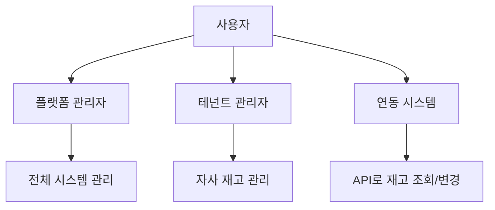

# 재고 관리 플랫폼 PRD (Product Requirements Document)

> **프로젝트 유형**: 별도 SaaS 플랫폼  
> **작성일**: 2025-12-22  
> **수정일**: 2025-12-25  
> **연관 프로젝트**: Shopping Mall (API 연동 예정)

---

## 1. 프로젝트 개요

| 항목 | 내용 |
|------|------|
| **프로젝트 이름** | Inventory Management Platform (재고 관리 플랫폼) |
| **목표** | 온라인/오프라인 통합 재고 관리 SaaS |
| **타겟 사용자** | 쇼핑몰 운영자, 오프라인 매장, 물류 관리자 |
| **비즈니스 모델** | B2B SaaS (API 기반 서비스 제공) |
| **기술 스택** | Node.js + Express + MongoDB (또는 PostgreSQL) |

---

## 2. 문제 정의

### 현재 문제점
- 온라인 쇼핑몰과 오프라인 매장의 재고가 따로 관리됨
- 실시간 재고 동기화 부재로 과잉판매(overselling) 발생
- 여러 채널의 재고 현황을 한눈에 파악하기 어려움
- 재고 변동 이력 추적 불가

### 해결 목표
- 단일 플랫폼에서 모든 채널의 재고 통합 관리
- API를 통해 다양한 시스템과 연동 가능
- 실시간 재고 동기화 및 알림

---

## 3. 사용자 유형



| 역할 | 설명 | 권한 |
|------|------|------|
| **플랫폼 관리자** | 시스템 전체 관리 | 테넌트 관리, 시스템 설정 |
| **테넌트 관리자** | 고객사 담당자 | 자사 재고 관리, API 키 발급 |
| **연동 시스템** | 쇼핑몰, POS 등 | API로 재고 조회/변경 |

---

## 4. 핵심 기능

### 4.1 멀티테넌트 관리

| 기능 | 설명 |
|------|------|
| 테넌트 생성 | 고객사별 독립 공간 생성 |
| API 키 발급 | 테넌트별 API 인증 키 관리 |
| 사용량 추적 | API 호출 횟수, 재고 수량 등 |

### 4.2 상품/SKU 관리

| 기능 | 설명 |
|------|------|
| SKU 등록 | 상품 고유 코드 등록 |
| 상품 정보 | 이름, 카테고리, 속성 등 |
| 외부 연결 | 외부 시스템의 상품 ID 매핑 |

#### 📐 하이브리드 필드 관리 시스템

> **설계 방식**: 공통 필드 + 카테고리 템플릿 + 테넌트 커스터마이징

```
┌─────────────────────────────────────────────────────┐
│                    Product                           │
├─────────────────────────────────────────────────────┤
│  🔒 공통 필드 (모든 상품 필수)                        │
│  - SKU, 바코드, 상품명, 가격, 이미지 등               │
├─────────────────────────────────────────────────────┤
│  📋 카테고리 템플릿 (미리 정의된 필드 세트)            │
│  - 식품 템플릿: 유통기한, 알레르기, 영양성분...        │
│  - 화장품 템플릿: 전성분, 사용기한, PAO...            │
│  - 의류 템플릿: 사이즈, 컬러, 소재...                 │
├─────────────────────────────────────────────────────┤
│  ⚙️ 테넌트 설정 (고객사별 커스터마이징)               │
│  - 사용할 필드 선택 ✅                               │
│  - 필드 순서 변경 ↕                                  │
│  - 커스텀 필드 추가 ➕                               │
│  - 필드 숨김/표시 👁                                │
└─────────────────────────────────────────────────────┘
```

#### 공통 필드 (Core Fields) - 모든 상품 필수

| 필드 | 필수 | 타입 | 설명 |
|------|:----:|------|------|
| **상품 코드 (SKU)** | ✅ | String | 내부 관리용 고유 코드 |
| **바코드** | ✅ | String | JAN/EAN 바코드 |
| **상품명** | ✅ | Object | 다국어 지원 (일본어/한국어/영어) |
| **브랜드** | ✅ | String | 제조사/브랜드명 |
| **카테고리** | ✅ | String | 상품 분류 |
| **정가 (희망소매가)** | - | Number | 정상 판매가격 (할인 전) |
| **판매가** | ✅ | Number | 실제 판매가격 |
| **할인율** | 자동 | Number | 자동 계산: (정가-판매가)/정가×100 |
| **원가** | - | Number | 매입 원가 |
| **세금 구분** | ✅ | Enum | 경감세율(8%)/표준세율(10%) |
| **원산지** | ✅ | String | 제조 원산지 |
| **메인 이미지** | ✅ | String | 상품 대표 이미지 |
| **서브 이미지** | - | Array | 추가 이미지들 |
| **판매 상태** | ✅ | Enum | 판매중/일시중지/판매종료 |
| **입수** | ✅ | Number | 케이스당 수량 |
| **외부 ID** | - | Object | 외부 플랫폼 연동용 ID |

> 💡 **할인 표시**: 정가가 입력되면 판매가와 비교하여 할인율이 자동 계산됩니다.
> ```
> 정가: 1,000엔 / 판매가: 800엔 → 20% OFF 표시
> ```

#### 카테고리 템플릿

| 템플릿 | 카테고리 | 주요 추가 필드 |
|--------|---------|---------------|
| **식품** | 한국식품 | 유통기한, 알레르기(28품목), 영양성분, 보관방법 |
| **화장품** | K-Beauty | 사용기한, PAO, 전성분, 분류(화장품/의약부외품) |
| **의류** | K-Fashion | 사이즈 옵션, 컬러 옵션, 소재(혼용률), 세탁표시 |
| **커스텀** | 기타 | 테넌트가 직접 정의 |

#### 테넌트별 필드 설정

```javascript
// 데이터 모델: TenantFieldConfig
{
  tenant: ObjectId,
  template: 'food' | 'cosmetic' | 'clothing' | 'custom',
  
  // 필드 활성화 설정
  enabledFields: [
    { fieldKey: 'expiryDate', enabled: true, required: true },
    { fieldKey: 'allergens', enabled: true, required: true },
    { fieldKey: 'nutrition', enabled: false, required: false },
    // ...
  ],
  
  // 필드 표시 순서
  fieldOrder: ['sku', 'barcode', 'name', 'expiryDate', ...],
  
  // 커스텀 필드
  customFields: [
    {
      key: 'supplier',
      label: { ja: '仕入先', ko: '수입처' },
      type: 'string',
      required: false
    }
  ]
}
```

#### 필드 설정 UI (관리자 화면)

```
┌─────────────────────────────────────────────────────┐
│  📋 상품 필드 설정                                   │
├─────────────────────────────────────────────────────┤
│  템플릿: [식품 ▼]                                   │
├─────────────────────────────────────────────────────┤
│  공통 필드 (변경 불가)                               │
│  ├── ✅ 상품 코드 (필수)                            │
│  ├── ✅ 바코드 (필수)                               │
│  └── ✅ 상품명 (필수)                               │
├─────────────────────────────────────────────────────┤
│  선택 필드                                          │
│  ├── ☑ 유통기한      [필수 ▼]                      │
│  ├── ☑ 알레르기 정보  [필수 ▼]                      │
│  ├── ☐ 영양 성분      [선택 ▼] ← 비활성화           │
│  └── ☑ 보관 방법      [선택 ▼]                      │
├─────────────────────────────────────────────────────┤
│  커스텀 필드                                         │
│  └── ☑ 수입처        [선택 ▼] ← 직접 추가           │
├─────────────────────────────────────────────────────┤
│  [+ 커스텀 필드 추가]  [↕ 순서 변경]  [💾 저장]      │
└─────────────────────────────────────────────────────┘
```

#### 필드 관리 API

```
# 필드 설정
GET    /api/field-config              - 현재 필드 설정 조회
PUT    /api/field-config              - 필드 설정 저장
POST   /api/field-config/custom       - 커스텀 필드 추가
DELETE /api/field-config/custom/:key  - 커스텀 필드 삭제

# 템플릿
GET    /api/templates                 - 사용 가능한 템플릿 목록
GET    /api/templates/:type           - 템플릿 상세 (필드 목록)
```


### 4.2.1 한국식품 상품 정보 요구사항

> **관리 대상**: 한국식품 (일본 시장 판매용)

#### 기본 정보

| 필드 | 필수 | 설명 |
|------|:----:|------|
| **상품 코드 (SKU)** | ✅ | 내부 관리용 고유 코드 |
| **바코드 (JAN/EAN)** | ✅ | 바코드 스캔용 |
| **상품명 (일본어)** | ✅ | 판매용 일본어 상품명 |
| **상품명 (한국어)** | - | 내부 관리용 한국어명 |
| **상품명 (영어)** | - | 영문 표기 |
| **브랜드** | ✅ | 제조사/브랜드명 |
| **카테고리** | ✅ | 상품 분류 |

#### 가격 정보

| 필드 | 필수 | 설명 |
|------|:----:|------|
| **판매가 (엔화)** | ✅ | 소비자 판매가격 |
| **원가** | - | 매입 원가 |
| **세금 구분** | ✅ | 경감세율(8%) / 표준세율(10%) |

#### 상품 속성

| 필드 | 필수 | 설명 |
|------|:----:|------|
| **원산지** | ✅ | 한국 (韓国産) |
| **중량/용량** | ✅ | 예: 500g, 1L |
| **입수 (케이스당 수량)** | ✅ | 박스당 몇 개 들이인지 |
| **규격** | - | 크기, 포장 형태 등 |

#### 유통/보관 정보

| 필드 | 필수 | 설명 |
|------|:----:|------|
| **보관 방법** | ✅ | 상온 / 냉장 / 냉동 |
| **유통기한 기본값** | - | 제조일로부터 기본 유통기한 (예: 180일) |
| **보관 온도** | - | 예: 0~10℃ |
| **취급 주의사항** | - | 직사광선 피할 것 등 |

#### 식품 표시 정보 (일본 법규 대응)

| 필드 | 필수 | 설명 |
|------|:----:|------|
| **원재료명** | ✅ | 일본어 표기 필요 |
| **알레르기 정보** | ✅ | 특정 7품목 + 권장 21품목 |
| **영양 성분** | ✅ | 열량, 단백질, 지방, 탄수화물, 나트륨 등 |
| **첨가물** | - | 사용된 첨가물 목록 |
| **유전자 변형 여부** | - | GMO 표시 |

#### 알레르기 표시 (일본 기준)

**특정원재료 7품목 (표시 의무)**
- 밀, 메밀, 달걀, 우유, 땅콩, 새우, 게

**특정원재료에 준하는 21품목 (표시 권장)**
- 아몬드, 전복, 오징어, 연어알, 오렌지, 캐슈넛, 키위, 소고기, 호두, 참깨, 연어, 고등어, 대두, 닭고기, 바나나, 돼지고기, 송이버섯, 복숭아, 참마, 사과, 젤라틴

#### 이미지/미디어

| 필드 | 필수 | 설명 |
|------|:----:|------|
| **메인 이미지** | ✅ | 상품 대표 이미지 |
| **서브 이미지** | - | 추가 이미지 (여러 장) |
| **원재료 라벨 이미지** | - | 뒷면 라벨 사진 |

#### 판매 채널 정보

| 필드 | 필수 | 설명 |
|------|:----:|------|
| **메이크샵 상품번호** | - | 외부 연동용 |
| **야후쇼핑 상품코드** | - | 외부 연동용 |
| **아마존 ASIN** | - | 외부 연동용 |
| **라쿠텐 상품번호** | - | 외부 연동용 |

#### 상태 관리

| 필드 | 필수 | 설명 |
|------|:----:|------|
| **판매 상태** | ✅ | 판매중 / 일시중지 / 판매종료 |
| **재고 상태** | 자동 | 재고있음 / 품절 / 입고예정 |
| **등록일** | 자동 | 상품 등록 일시 |
| **수정일** | 자동 | 최종 수정 일시 |

#### 기타

| 필드 | 필수 | 설명 |
|------|:----:|------|
| **상세 설명** | - | 상품 상세 정보 (HTML) |
| **검색 키워드** | - | 내부 검색용 태그 |
| **메모** | - | 관리자용 메모 |

### 4.2.2 한국화장품 상품 정보 요구사항

> **관리 대상**: 한국 화장품/K-Beauty (일본 시장 판매용)

#### 기본 정보

| 필드 | 필수 | 설명 |
|------|:----:|------|
| **상품 코드 (SKU)** | ✅ | 내부 관리용 고유 코드 |
| **바코드 (JAN/EAN)** | ✅ | 바코드 스캔용 |
| **상품명 (일본어)** | ✅ | 판매용 일본어 상품명 |
| **상품명 (한국어)** | - | 내부 관리용 한국어명 |
| **상품명 (영어)** | - | 영문 표기 |
| **브랜드** | ✅ | 제조사/브랜드명 |
| **시리즈/라인** | - | 제품 라인명 (예: 설화수 자음생) |
| **카테고리** | ✅ | 상품 분류 |

#### 화장품 카테고리

| 대분류 | 중분류 예시 |
|--------|------------|
| **스킨케어** | 토너, 에센스, 세럼, 크림, 아이크림, 마스크팩 |
| **메이크업** | 파운데이션, 립스틱, 아이섀도, 마스카라 |
| **클렌징** | 클렌징폼, 클렌징오일, 클렌징워터 |
| **선케어** | 선크림, 선스틱, 선쿠션 |
| **바디케어** | 바디로션, 바디워시, 핸드크림 |
| **헤어케어** | 샴푸, 트리트먼트, 헤어에센스 |
| **남성용** | 올인원, 쉐이빙 |

#### 가격 정보

| 필드 | 필수 | 설명 |
|------|:----:|------|
| **판매가 (엔화)** | ✅ | 소비자 판매가격 |
| **원가** | - | 매입 원가 |
| **세금 구분** | ✅ | 표준세율 10% |

#### 상품 속성

| 필드 | 필수 | 설명 |
|------|:----:|------|
| **원산지** | ✅ | 한국 (韓国製) |
| **용량** | ✅ | 예: 50ml, 30g |
| **제형** | - | 크림, 로션, 젤, 오일 등 |
| **피부 타입** | - | 건성, 지성, 복합성, 민감성, 모든피부 |
| **입수 (케이스당 수량)** | ✅ | 박스당 몇 개 들이인지 |

#### 유통/보관 정보

| 필드 | 필수 | 설명 |
|------|:----:|------|
| **사용기한** | ✅ | 제조일로부터 사용기한 (예: 36개월) |
| **개봉 후 사용기한** | - | PAO (Period After Opening) - 예: 12M |
| **보관 방법** | - | 직사광선 피하고 서늘한 곳 |
| **제조일자** | - | 로트별 제조일 |

#### 화장품 법규 정보 (일본 약기법 대응)

| 필드 | 필수 | 설명 |
|------|:----:|------|
| **화장품 분류** | ✅ | 化粧品 / 医薬部外品 |
| **전성분 (일본어)** | ✅ | 일본어 INCI 표기 |
| **사용 방법** | ✅ | 일본어 사용법 |
| **사용상 주의사항** | ✅ | 일본어 주의사항 |
| **제조판매원** | ✅ | 일본 내 제조판매 책임업체 |
| **원산국** | ✅ | 韓国 |

#### 알레르기/주의 성분

| 분류 | 내용 |
|------|------|
| **알레르기 유발 가능 성분** | 향료, 색소 등 |
| **사용 주의 성분** | 레티놀, AHA/BHA, 하이드로퀴논 등 |
| **비건 여부** | 동물성 원료 미사용 여부 |
| **무첨가 정보** | 파라벤프리, 무향료, 무색소 등 |

#### 이미지/미디어

| 필드 | 필수 | 설명 |
|------|:----:|------|
| **메인 이미지** | ✅ | 상품 대표 이미지 |
| **서브 이미지** | - | 추가 이미지 (여러 장) |
| **성분 표시 이미지** | - | 전성분 표시 라벨 |
| **텍스처 이미지** | - | 제형/발색 이미지 |

#### 판매 채널 정보

| 필드 | 필수 | 설명 |
|------|:----:|------|
| **메이크샵 상품번호** | - | 외부 연동용 |
| **야후쇼핑 상품코드** | - | 외부 연동용 |
| **아마존 ASIN** | - | 외부 연동용 |
| **라쿠텐 상품번호** | - | 외부 연동용 |
| **Qoo10 상품번호** | - | K-Beauty 인기 채널 |

#### 상태 관리

| 필드 | 필수 | 설명 |
|------|:----:|------|
| **판매 상태** | ✅ | 판매중 / 일시중지 / 판매종료 |
| **재고 상태** | 자동 | 재고있음 / 품절 / 입고예정 |
| **한정판 여부** | - | 한정판 / 시즌 한정 |
| **등록일** | 자동 | 상품 등록 일시 |
| **수정일** | 자동 | 최종 수정 일시 |

#### 기타

| 필드 | 필수 | 설명 |
|------|:----:|------|
| **상세 설명** | - | 상품 상세 정보 (HTML) |
| **효능/효과** | - | 주요 효능 (보습, 미백, 주름개선 등) |
| **검색 키워드** | - | 내부 검색용 태그 |
| **메모** | - | 관리자용 메모 |


### 4.2.3 의류 상품 정보 요구사항

> **관리 대상**: 의류/패션 아이템 (K-Fashion)

#### 기본 정보

| 필드 | 필수 | 설명 |
|------|:----:|------|
| **상품 코드 (SKU)** | ✅ | 내부 관리용 고유 코드 |
| **바코드 (JAN/EAN)** | ✅ | 바코드 스캔용 |
| **상품명 (일본어)** | ✅ | 판매용 일본어 상품명 |
| **상품명 (한국어)** | - | 내부 관리용 한국어명 |
| **브랜드** | ✅ | 브랜드명 |
| **카테고리** | ✅ | 상품 분류 |
| **시즌** | - | SS(봄여름) / FW(가을겨울) / 연중 |

#### 의류 카테고리

| 대분류 | 중분류 예시 |
|--------|------------|
| **아우터** | 코트, 재킷, 점퍼, 패딩, 가디건 |
| **상의** | 티셔츠, 셔츠, 블라우스, 니트, 후드 |
| **하의** | 바지, 청바지, 스커트, 쇼츠 |
| **원피스** | 롱원피스, 미니원피스, 점프수트 |
| **정장** | 수트, 블레이저, 슬랙스 |
| **스포츠웨어** | 레깅스, 운동복, 요가복 |
| **언더웨어** | 속옷, 양말, 홈웨어 |
| **악세서리** | 가방, 모자, 스카프, 벨트 |
| **신발** | 스니커즈, 부츠, 샌들, 힐 |

#### 가격 정보

| 필드 | 필수 | 설명 |
|------|:----:|------|
| **판매가 (엔화)** | ✅ | 소비자 판매가격 |
| **원가** | - | 매입 원가 |
| **세금 구분** | ✅ | 표준세율 10% |

#### 옵션 (사이즈/컬러)

| 필드 | 필수 | 설명 |
|------|:----:|------|
| **사이즈 옵션** | ✅ | XS, S, M, L, XL, XXL 또는 Free |
| **컬러 옵션** | ✅ | 색상 목록 (일본어 표기) |
| **옵션별 SKU** | ✅ | 사이즈/컬러 조합별 고유 SKU |
| **옵션별 재고** | ✅ | 각 옵션별 재고 수량 |
| **옵션별 바코드** | - | 옵션별 개별 바코드 |

#### 사이즈 정보

| 필드 | 필수 | 설명 |
|------|:----:|------|
| **사이즈 표기** | ✅ | S/M/L 또는 숫자 (55, 66, 77...) |
| **실측 사이즈** | - | 어깨, 가슴, 허리, 엉덩이, 총장 등 (cm) |
| **모델 착용 정보** | - | 모델 키/체중, 착용 사이즈 |

#### 상품 속성

| 필드 | 필수 | 설명 |
|------|:----:|------|
| **원산지** | ✅ | 한국, 중국, 베트남 등 |
| **소재 (혼용률)** | ✅ | 예: 면 60%, 폴리에스터 40% |
| **핏** | - | 레귤러핏, 오버핏, 슬림핏 |
| **두께감** | - | 얇음, 보통, 두꺼움 |
| **신축성** | - | 없음, 약간 있음, 좋음 |
| **안감** | - | 있음 / 없음 / 부분안감 |
| **투명도** | - | 비침 없음 / 약간 비침 / 비침 있음 |
| **입수 (케이스당 수량)** | ✅ | 박스당 몇 개 들이인지 |

#### 의류 표시법 정보 (일본 가정용품 품질표시법)

| 필드 | 필수 | 설명 |
|------|:----:|------|
| **섬유 조성 (일본어)** | ✅ | 예: 綿60%、ポリエステル40% |
| **세탁 표시** | ✅ | 일본 JIS 세탁 기호 |
| **원산국** | ✅ | 韓国製, 中国製 등 |
| **취급 주의사항** | - | 세탁/건조 주의사항 |
| **표시자** | ✅ | 일본 내 표시 책임자 |

#### 세탁 기호 (JIS L 0001)

| 분류 | 예시 |
|------|------|
| **세탁** | 물세탁 가능/불가, 온도 제한 |
| **표백** | 표백 가능/불가 |
| **건조** | 텀블건조 가능/불가, 자연건조 |
| **다림질** | 다림질 온도 |
| **드라이클리닝** | 가능/불가 |

#### 이미지/미디어

| 필드 | 필수 | 설명 |
|------|:----:|------|
| **메인 이미지** | ✅ | 상품 대표 이미지 |
| **서브 이미지** | - | 다각도 이미지 (여러 장) |
| **상세 이미지** | - | 소재, 디테일 클로즈업 |
| **착용 이미지** | - | 모델 착용샷 |
| **컬러별 이미지** | ✅ | 각 컬러 옵션별 이미지 |

#### 판매 채널 정보

| 필드 | 필수 | 설명 |
|------|:----:|------|
| **메이크샵 상품번호** | - | 외부 연동용 |
| **야후쇼핑 상품코드** | - | 외부 연동용 |
| **아마존 ASIN** | - | 외부 연동용 |
| **라쿠텐 상품번호** | - | 외부 연동용 |
| **ZOZOTOWN 상품코드** | - | 일본 패션 전문 채널 |

#### 상태 관리

| 필드 | 필수 | 설명 |
|------|:----:|------|
| **판매 상태** | ✅ | 판매중 / 일시중지 / 판매종료 |
| **재고 상태** | 자동 | 재고있음 / 품절 / 입고예정 |
| **시즌 상품** | - | 정규 / 시즌한정 / 리미티드 |
| **등록일** | 자동 | 상품 등록 일시 |
| **수정일** | 자동 | 최종 수정 일시 |

#### 기타

| 필드 | 필수 | 설명 |
|------|:----:|------|
| **상세 설명** | - | 상품 상세 정보 (HTML) |
| **스타일링 팁** | - | 코디 제안 |
| **검색 키워드** | - | 내부 검색용 태그 |
| **메모** | - | 관리자용 메모 |


### 4.3 창고/매장 관리

| 기능 | 설명 |
|------|------|
| 위치 등록 | 온라인 창고, 오프라인 매장 등록 |
| 위치별 재고 | 각 위치의 개별 재고 관리 |
| 위치 유형 | `warehouse`, `store`, `online` |

### 4.4 재고 관리 (핵심)

| 기능 | 설명 |
|------|------|
| 재고 조회 | SKU별, 위치별 재고 확인 |
| 재고 예약 | 주문 시 임시 홀딩 |
| 재고 확정 | 결제 완료 시 실제 차감 |
| 재고 복구 | 취소/환불 시 복원 |
| 재고 이동 | 위치 간 재고 이전 |
| 재고 조정 | 수동 재고 보정 |

### 4.5 공급처 관리 (Supplier)

> 상품별 공급처(거래처) 정보 관리

| 필드 | 필수 | 설명 |
|------|:----:|------|
| **공급처 코드** | ✅ | 내부 관리용 코드 |
| **공급처명** | ✅ | 거래처/수입처 이름 |
| **담당자명** | - | 거래처 담당자 |
| **연락처** | ✅ | 전화번호 |
| **이메일** | - | 이메일 주소 |
| **주소** | - | 거래처 주소 |
| **거래 조건** | - | 결제 조건, MOQ 등 |
| **메모** | - | 특이사항 |

```javascript
// Supplier 데이터 모델
{
  tenant: ObjectId,
  code: 'SUP001',
  name: 'OO무역',
  contact: {
    person: '김담당',
    phone: '010-1234-5678',
    email: 'contact@supplier.com'
  },
  address: '서울시 강남구...',
  terms: {
    paymentDays: 30,        // 결제 조건 (30일)
    minimumOrder: 100       // 최소 주문 수량
  },
  isActive: true
}
```

### 4.6 발주 관리 (Ordering)

> 재고 부족 시 자동/수동 발주 관리

#### 상품별 발주 설정

| 필드 | 필수 | 설명 |
|------|:----:|------|
| **발주점 (Reorder Point)** | ✅ | 이 수량 이하 시 발주 알림 |
| **발주 수량 (Reorder Qty)** | ✅ | 기본 발주 수량 |
| **리드타임 (Lead Time)** | - | 발주~입고 소요일 |
| **안전 재고** | - | 최소 유지 재고 수량 |
| **기본 공급처** | - | 해당 상품의 주 공급처 |

```javascript
// 상품별 발주 설정 예시
{
  sku: 'SINRAMEN-001',
  supplier: ObjectId,            // 기본 공급처
  reorderPoint: 100,             // 100개 이하 시 알림
  reorderQuantity: 500,          // 기본 발주 500개
  leadTime: 7,                   // 7일 소요
  safetyStock: 50                // 최소 50개 유지
}
```

#### 발주 흐름

```
[1] 재고 감소 → reorderPoint 이하 감지
[2] 알림 발송 (이메일/대시보드)
[3] 관리자 확인 → 발주서 생성
[4] 공급처에 발주서 전송 (이메일/FAX)
[5] 입고 시 발주 완료 처리
```

#### 발주서 데이터 모델

```javascript
// PurchaseOrder (발주서)
{
  tenant: ObjectId,
  orderNumber: 'PO-20241225-001',
  supplier: ObjectId,
  
  items: [
    {
      sku: 'SINRAMEN-001',
      productName: '신라면',
      quantity: 500,
      unitPrice: 100,
      totalPrice: 50000
    }
  ],
  
  status: 'draft' | 'sent' | 'confirmed' | 'received' | 'cancelled',
  expectedDate: Date,            // 예상 입고일
  receivedDate: Date,            // 실제 입고일
  
  createdBy: ObjectId,
  createdAt: Date
}
```

#### 발주 API

```
# 공급처
GET    /api/suppliers              - 공급처 목록
POST   /api/suppliers              - 공급처 등록
PUT    /api/suppliers/:id          - 공급처 수정
DELETE /api/suppliers/:id          - 공급처 삭제

# 발주
GET    /api/purchase-orders        - 발주서 목록
POST   /api/purchase-orders        - 발주서 생성
PUT    /api/purchase-orders/:id    - 발주서 수정
POST   /api/purchase-orders/:id/send     - 발주서 전송
POST   /api/purchase-orders/:id/receive  - 입고 완료 처리

# 발주 알림
GET    /api/reorder-alerts         - 발주 필요 상품 목록
```

### 4.7 알림 시스템

| 기능 | 설명 |
|------|------|
| 저재고 알림 | 설정 수량 이하 시 알림 |
| 품절 알림 | 재고 0 도달 시 알림 |
| Webhook | 연동 시스템에 실시간 이벤트 전송 |

### 4.8 대시보드

| 기능 | 설명 |
|------|------|
| 전체 현황 | 총 재고, 위치별 분포 |
| 저재고 목록 | 주의가 필요한 상품 |
| 변동 이력 | 최근 재고 변동 내역 |
| 통계 | 회전율, 판매 추이 등 |

---

### 4.9 통합 주문/배송 관리

> 여러 플랫폼에서 들어온 주문을 한 곳에서 관리하고 배송 상태 추적

#### 문제 해결

```
[기존 문제]
야후 주문 따로 + 메이크샵 따로 + 자체몰 따로 → 놓치기 쉬움! ❌

[해결]
┌────────┐  ┌────────┐  ┌────────┐
│  야후   │  │메이크샵│  │ 자체몰  │
└────────┘  └────────┘  └────────┘
     │           │           │
     └───────────┼───────────┘
                 ▼
    ┌────────────────────────────┐
    │    📦 통합 주문/배송 관리     │
    │    한눈에 파악! ✅           │
    └────────────────────────────┘
```

#### 주문 상태 흐름

```
[외부 주문 수신] → [대기중] → [포장중] → [발송완료] → [배송완료]
       ↓              ↓          ↓           ↓
    자동 수신      작업 시작    송장 등록   배송사 API
```

#### 통합 주문 목록 화면

```
┌─────────────────────────────────────────────────────────────────┐
│  📋 주문 관리                    [전체] [미처리] [발송대기]      │
├─────────────────────────────────────────────────────────────────┤
│  ☐ │ 주문번호    │ 상품          │ 플랫폼  │ 상태   │ 주문일     │
├─────────────────────────────────────────────────────────────────┤
│  ☐ │ Y-001      │ 신라면 외 2건  │ 야후    │ ⏳대기  │ 12/25 10:00│
│  ☐ │ M-002      │ 김치 1건      │ 메이크샵 │ 📦포장  │ 12/25 09:30│
│  ☑ │ S-003      │ 라면 5건      │ 자체몰  │ ✅발송  │ 12/24 15:00│
├─────────────────────────────────────────────────────────────────┤
│  ⚠️ 미처리: 1건    📦 포장중: 1건    ✅ 완료: 1건               │
├─────────────────────────────────────────────────────────────────┤
│  [일괄 포장 시작]  [송장 출력]  [배송 완료 처리]                  │
└─────────────────────────────────────────────────────────────────┘
```

#### 주문 데이터 모델

```javascript
// Order (통합 주문)
{
  tenant: ObjectId,
  orderNumber: 'Y-20241225-001',
  
  // 출처
  source: 'yahoo' | 'makeshop' | 'rakuten' | 'custom',
  externalOrderId: 'YAHOO-123456',
  
  // 고객 정보
  customer: {
    name: '야마다 타로',
    phone: '090-1234-5678',
    email: 'customer@example.com'
  },
  
  // 배송 정보
  shipping: {
    name: '야마다 타로',
    postalCode: '123-4567',
    address: '東京都渋谷区...',
    phone: '090-1234-5678'
  },
  
  // 주문 상품
  items: [
    {
      sku: 'SINRAMEN-001',
      productName: '신라면',
      quantity: 5,
      unitPrice: 200,
      totalPrice: 1000
    }
  ],
  
  // 금액
  subtotal: 1000,
  shippingFee: 500,
  total: 1500,
  
  // 상태
  status: 'pending' | 'processing' | 'packed' | 'shipped' | 'delivered' | 'cancelled',
  
  // 배송
  carrier: 'yamato' | 'sagawa' | 'japanpost' | 'other',
  trackingNumber: '1234-5678-9012',
  shippedAt: Date,
  deliveredAt: Date,
  
  // 타임스탬프
  orderedAt: Date,
  createdAt: Date,
  updatedAt: Date
}
```

#### 배송 상태

| 상태 | 설명 | 액션 |
|------|------|------|
| **pending** | 주문 접수, 처리 대기 | 포장 시작 |
| **processing** | 포장 준비 중 | - |
| **packed** | 포장 완료, 발송 대기 | 송장 입력 |
| **shipped** | 발송 완료 | 배송 추적 |
| **delivered** | 배송 완료 | - |
| **cancelled** | 취소됨 | 재고 복구 |

#### 송장 출력 기능

| 기능 | 설명 |
|------|------|
| **개별 출력** | 선택한 주문의 송장 출력 |
| **일괄 출력** | 여러 주문 한 번에 출력 |
| **택배사 연동** | 야마토, 사가와, 우체국 API 연동 |
| **송장 번호 자동 등록** | 발송 후 송장 번호 자동 업데이트 |

#### 택배사 연동

```javascript
// Carrier 설정
const carriers = {
  yamato: {
    name: 'ヤマト運輸',
    apiUrl: 'https://api.kuronekoyamato.co.jp/...',
    trackingUrl: 'https://jizen.kuronekoyamato.co.jp/jizen/servlet/crjz.b.NQ0010?id='
  },
  sagawa: {
    name: '佐川急便',
    trackingUrl: 'https://k2k.sagawa-exp.co.jp/p/web/okurijolookup.do?okurijoNo='
  },
  japanpost: {
    name: '日本郵便',
    trackingUrl: 'https://trackings.post.japanpost.jp/services/srv/search?requestNo1='
  }
};
```

#### 주문/배송 알림

| 알림 | 조건 | 대상 |
|------|------|------|
| **미처리 주문** | 24시간 이상 대기 | 관리자 |
| **발송 지연** | 포장 완료 후 24시간 이상 | 관리자 |
| **배송 완료** | 배송 추적 API 확인 | 고객 (선택) |

#### 주문/배송 API

```
# 주문 관리
GET    /api/orders                   - 주문 목록 (필터: 상태, 플랫폼, 날짜)
GET    /api/orders/:id               - 주문 상세
PUT    /api/orders/:id/status        - 상태 변경
POST   /api/orders/:id/pack          - 포장 시작
POST   /api/orders/:id/ship          - 발송 처리 (송장 등록)

# 송장
POST   /api/orders/bulk-print        - 일괄 송장 출력
GET    /api/orders/:id/tracking      - 배송 추적

# 대시보드
GET    /api/orders/summary           - 주문 현황 요약 (미처리, 포장중, 발송완료 건수)
GET    /api/orders/alerts            - 미처리/지연 알림 목록
```

---

## 5. API 설계 (초안)

### 5.1 인증
```
POST /api/auth/token     - API 토큰 발급
```

### 5.2 상품 (Products)
```
GET    /api/products           - 상품 목록
POST   /api/products           - 상품 등록
GET    /api/products/:sku      - 상품 상세
PUT    /api/products/:sku      - 상품 수정
DELETE /api/products/:sku      - 상품 삭제
```

### 5.3 위치 (Locations)
```
GET    /api/locations          - 위치 목록
POST   /api/locations          - 위치 등록
GET    /api/locations/:id      - 위치 상세
PUT    /api/locations/:id      - 위치 수정
```

### 5.4 재고 (Inventory) - 핵심 API
```
GET    /api/inventory                    - 전체 재고 조회
GET    /api/inventory/:sku               - SKU별 재고 조회
GET    /api/inventory/:sku/:locationId   - 특정 위치 재고

POST   /api/inventory/reserve            - 재고 예약 (주문시)
POST   /api/inventory/confirm            - 재고 확정 (결제후)
POST   /api/inventory/release            - 재고 복구 (취소시)
POST   /api/inventory/transfer           - 재고 이동
POST   /api/inventory/adjust             - 재고 조정
```

### 5.5 이력 (Logs)
```
GET    /api/logs                - 변동 이력 조회
GET    /api/logs/:sku           - SKU별 이력
```

### 5.6 Webhook
```
POST   /api/webhooks           - Webhook 등록
GET    /api/webhooks           - Webhook 목록
DELETE /api/webhooks/:id       - Webhook 삭제
```

---

## 6. 데이터 모델 (초안)

### Tenant (테넌트/고객사)
```
- name: 회사명
- apiKey: API 키
- plan: 요금제
- isActive: 활성화
```

### Product (상품)
```
- tenant: 테넌트 참조
- sku: 상품 코드 (unique per tenant)
- name: 상품명
- category: 카테고리
- attributes: { 색상, 사이즈, ... }
- externalIds: { // 각 플랫폼별 고유 식별값 매핑
    makeshop: String,  // 메이크샵 상품번호
    yahoo: String,     // 야후 쇼핑 상품/서브코드
    amazon: String,    // 아마존 ASIN/SKU
    rakuten: String    // 라쿠텐 상품번호
  }
```

### Location (위치/창고/매장)
```
- tenant: 테넌트 참조
- name: 위치명
- type: 'warehouse' | 'store' | 'online'
- address: 주소
- isActive: 활성화
```

### Inventory (재고)
```
- tenant: 테넌트 참조
- product: 상품 참조
- location: 위치 참조
- available: 가용 재고
- reserved: 예약된 재고
- lowStockThreshold: 저재고 기준
```

### InventoryLog (재고 이력)
```
- inventory: 재고 참조
- type: 'order' | 'return' | 'transfer' | 'adjust' | 'sale'
- quantity: 변동 수량 (+/-)
- reference: 주문번호 등
- reason: 사유
- createdBy: 작업자
- createdAt: 시간
```

### Webhook
```
- tenant: 테넌트 참조
- url: 콜백 URL
- events: ['stock_low', 'out_of_stock', ...]
- isActive: 활성화
```

---

## 7. 쇼핑몰 연동 시나리오

### 7.1 상품 페이지 조회
```
쇼핑몰 → GET /api/inventory/PROD001
← { sku: 'PROD001', available: 50, reserved: 5 }
```

### 7.2 주문 프로세스
```
[1] 결제 시작
쇼핑몰 → POST /api/inventory/reserve
{ sku: 'PROD001', quantity: 2, orderId: 'ORD-001' }
← { success: true, reservationId: 'RES-xxx' }

[2] 결제 성공
쇼핑몰 → POST /api/inventory/confirm
{ reservationId: 'RES-xxx' }
← { success: true, newAvailable: 48 }

[3] 결제 실패/취소
쇼핑몰 → POST /api/inventory/release
{ reservationId: 'RES-xxx' }
← { success: true, restored: 2 }
```

### 7.3 Webhook 수신
```
재고 플랫폼 → POST (쇼핑몰 webhook URL)
{
  "event": "stock_low",
  "sku": "PROD001",
  "available": 3,
  "threshold": 5
}
```

---

## 8. 외부 플랫폼 연동

### 8.1 연동 아키텍처

```
┌─────────────────────────────────────────────────────────┐
│              재고 관리 플랫폼 (Core)                      │
├─────────────────────────────────────────────────────────┤
│                    연동 플러그인                          │
│  ┌──────────┐ ┌──────────┐ ┌──────────┐ ┌──────────┐   │
│  │ MakeShop │ │  Yahoo   │ │  Amazon  │ │ Rakuten  │   │
│  │ 메이크샵  │ │ 야후쇼핑  │ │  아마존   │ │  라쿠텐   │   │
│  └──────────┘ └──────────┘ └──────────┘ └──────────┘   │
│        테넌트별 활성화/비활성화 가능                       │
└─────────────────────────────────────────────────────────┘
```

### 8.2 테넌트별 연동 설정

```javascript
// 데이터 모델: TenantIntegration
{
  tenant: ObjectId,
  platform: 'makeshop' | 'yahoo' | 'amazon' | 'rakuten',
  enabled: Boolean,
  credentials: {
    apiKey: String,
    secretKey: String,
    shopId: String,      // 플랫폼별 상점 ID
    // ... 기타 인증 정보
  },
  settings: {
    autoSync: Boolean,   // 자동 재고 동기화
    syncInterval: Number // 동기화 주기 (분)
  }
}
```

### 8.3 플랫폼별 연동 요구사항

| 플랫폼 | 연동 방식 | 주요 기능 | 우선순위 |
|--------|----------|----------|:--------:|
| **메이크샵** | REST API | 상품 조회, 재고 업데이트 | 🥇 1순위 |
| **야후쇼핑** | REST API | 상품 조회, 재고/가격 업데이트 | 🥇 1순위 |
| **아마존** | SP-API | 상품 조회, 재고 업데이트 | 🥈 2순위 |
| **라쿠텐** | RMS API | 상품 조회, 재고 업데이트 | 🥈 2순위 |

### 8.4 공통 연동 인터페이스

```javascript
// 모든 플랫폼 연동 모듈은 이 인터페이스를 구현
interface PlatformConnector {
  // 연결 테스트
  testConnection(): Promise<boolean>
  
  // 상품 동기화
  fetchProducts(): Promise<Product[]>
  
  // 재고 조회
  getStock(externalId: string): Promise<number>
  
  // 재고 업데이트
  updateStock(externalId: string, quantity: number): Promise<boolean>
  
  // 주문 조회 (선택)
  fetchOrders(): Promise<Order[]>
}
```

### 8.5 연동 시나리오

**A. 재고 자동 동기화 (플랫폼 → 재고관리)**
```
[1] 외부 플랫폼에서 주문 발생
[2] Webhook 또는 폴링으로 감지
[3] 재고 플랫폼에 반영
[4] 다른 연동 플랫폼에 재고 업데이트
```

**B. 재고 Push (재고관리 → 플랫폼)**
```
[1] 재고 플랫폼에서 재고 변경
[2] 활성화된 모든 플랫폼에 재고 업데이트 API 호출
```

### 8.6 플랫폼별 API 정보 (참고)

| 플랫폼 | API 문서 | 인증 방식 |
|--------|----------|----------|
| 메이크샵 | [MakeShop API](https://www.makeshop.co.kr/) | API Key |
| 야후쇼핑 | [Yahoo Shopping API](https://developer.yahoo.co.jp/) | OAuth 2.0 |
| 아마존 | [Amazon SP-API](https://developer-docs.amazon.com/sp-api/) | AWS Signature |
| 라쿠텐 | [Rakuten RMS](https://webservice.rms.rakuten.co.jp/) | Service Secret |

### 8.7 연동 관리 API

```
GET    /api/integrations              - 연동 목록
POST   /api/integrations              - 연동 추가
PUT    /api/integrations/:id          - 연동 설정 변경
DELETE /api/integrations/:id          - 연동 삭제
POST   /api/integrations/:id/test     - 연결 테스트
POST   /api/integrations/:id/sync     - 수동 동기화
```

---

## 8.8 상품 동기화

### 8.8.1 상품 Push (재고 플랫폼 → 외부 채널)

> 재고 플랫폼에서 등록한 상품을 외부 채널(야후, 메이크샵 등)에 자동 등록

#### 동기화 흐름

```
┌─────────────────────────────────────────────────────────────┐
│                    재고 플랫폼                               │
│  상품 등록/수정 → 동기화 대상 플랫폼 선택                     │
└─────────────────────────────────────────────────────────────┘
                            │
                    ┌───────┴───────┐
                    │  필드 매핑 엔진 │
                    └───────┬───────┘
          ┌─────────────────┼─────────────────┐
          ▼                 ▼                 ▼
   ┌──────────┐      ┌──────────┐      ┌──────────┐
   │ 야후쇼핑  │      │ 메이크샵  │      │ 자체 몰  │
   │ API/CSV  │      │ API/CSV  │      │   API   │
   └──────────┘      └──────────┘      └──────────┘
```

#### 필드 매핑 (Field Mapping)

```javascript
// 데이터 모델: PlatformFieldMapping
{
  tenant: ObjectId,
  platform: 'yahoo' | 'makeshop' | 'rakuten' | 'amazon',
  mappings: [
    {
      platformField: '商品コード',    // 외부 플랫폼 필드명
      internalField: 'sku',           // 우리 시스템 필드
      transform: null                  // 변환 함수 (optional)
    },
    {
      platformField: '販売価格',
      internalField: 'price',
      transform: 'addTax'              // 세금 포함 변환
    },
    {
      platformField: '商品名',
      internalField: 'name.ja'
    }
  ]
}
```

#### 필드 매핑 설정 UI

```
┌─────────────────────────────────────────────────────┐
│  📋 야후쇼핑 필드 매핑 설정                          │
├─────────────────────────────────────────────────────┤
│                                                     │
│  야후 CSV 컬럼          →   우리 시스템 필드        │
│  ─────────────────────────────────────────────      │
│  商品コード             →   [SKU ▼]                 │
│  商品名                 →   [상품명 (일본어) ▼]      │
│  販売価格               →   [판매가 ▼]              │
│  商品説明               →   [상세설명 ▼]            │
│  在庫数                 →   [재고수량 ▼]            │
│  JANコード              →   [바코드 ▼]              │
│                                                     │
├─────────────────────────────────────────────────────┤
│  [CSV 템플릿 다운로드]  [매핑 테스트]  [💾 저장]     │
└─────────────────────────────────────────────────────┘
```

#### 동기화 방식

| 방식 | 설명 | 사용 시점 |
|------|------|----------|
| **실시간 API** | 상품 저장 시 자동 Push | API 지원 플랫폼 |
| **CSV 내보내기** | 관리자가 다운로드 후 업로드 | API 미지원 플랫폼 |
| **예약 동기화** | 매일 특정 시간에 일괄 동기화 | 대량 상품 관리 시 |

### 8.8.2 외부 주문 수신 프로세스

> 외부 채널에서 발생한 주문을 자동으로 감지하여 재고 차감

#### 주문 수신 흐름

```
┌──────────────────────────────────────────────────────────────┐
│  외부 채널 (야후/메이크샵/독립몰)                              │
│  고객 주문 → 결제 완료                                        │
└──────────────────────────────────────────────────────────────┘
                            │
            ┌───────────────┴───────────────┐
            │                               │
    [Webhook 방식]                   [폴링 방식]
            │                               │
            ▼                               ▼
┌───────────────────┐           ┌───────────────────┐
│ 플랫폼에서 Webhook │           │ 주기적으로 API로   │
│ 우리 서버로 전송   │           │ 주문 조회          │
└───────────────────┘           └───────────────────┘
            │                               │
            └───────────────┬───────────────┘
                            ▼
┌──────────────────────────────────────────────────────────────┐
│                    재고 플랫폼                                │
│  [1] 주문 데이터 수신                                         │
│  [2] 주문 상품 확인 (SKU 매핑)                                │
│  [3] 재고 예약/차감 (reserve → confirm)                       │
│  [4] 다른 연동 채널에 재고 업데이트 Push                       │
└──────────────────────────────────────────────────────────────┘
```

#### 주문 수신 데이터 모델

```javascript
// ExternalOrder (외부 주문)
{
  tenant: ObjectId,
  platform: 'yahoo' | 'makeshop' | 'rakuten' | 'custom',
  externalOrderId: 'Y-20231224-001234',  // 외부 주문번호
  
  // 주문 정보
  orderDate: Date,
  customer: {
    name: String,
    email: String,
    phone: String
  },
  
  // 주문 상품
  items: [
    {
      externalProductId: 'YAHOO-SKU-001',
      sku: 'PROD001',              // 매핑된 내부 SKU
      quantity: 2,
      price: 500
    }
  ],
  
  // 처리 상태
  status: 'pending' | 'processed' | 'failed',
  processedAt: Date,
  error: String
}
```

#### 재고 차감 자동화

```
[예시: 야후쇼핑에서 신라면 5개 주문]

1. 야후 → Webhook → 재고 플랫폼
   { orderId: 'Y-001', items: [{ sku: '8801043029315', qty: 5 }] }

2. 재고 플랫폼 처리:
   - SKU 매핑: 8801043029315 → 내부 'SINRAMEN-001'
   - 재고 확인: 현재 1000개
   - 재고 차감: 1000 - 5 = 995개
   - FEFO 적용: 가장 상미기간 짧은 로트에서 차감

3. 재고 업데이트 Push:
   - 메이크샵: 재고 995개로 업데이트
   - 자체 몰: 재고 995개로 업데이트
```

### 8.8.3 상품 동기화 API

```
# 필드 매핑
GET    /api/mappings/:platform              - 플랫폼별 매핑 조회
PUT    /api/mappings/:platform              - 매핑 저장
GET    /api/mappings/:platform/template     - CSV 템플릿 다운로드

# 상품 Push
POST   /api/sync/products/push              - 상품 외부 채널로 Push
POST   /api/sync/products/push/:platform    - 특정 플랫폼으로 Push
GET    /api/sync/products/status            - 동기화 상태 조회

# CSV 내보내기/가져오기
POST   /api/export/:platform                - CSV 생성/다운로드
POST   /api/import/:platform                - CSV 업로드 및 파싱

# 외부 주문 수신
POST   /api/orders/external                 - Webhook 수신 엔드포인트
GET    /api/orders/external                 - 외부 주문 목록
POST   /api/orders/external/:id/process     - 수동 처리
```

### 8.8.4 동기화 대시보드

| 항목 | 표시 내용 |
|------|----------|
| **동기화 상태** | 각 플랫폼별 마지막 동기화 시간 |
| **실패 내역** | Push 실패한 상품 목록 |
| **주문 수신** | 오늘/이번주 수신된 외부 주문 수 |
| **재고 일치율** | 플랫폼별 재고 불일치 상품 |

### 8.8.5 동기화 안전장치 (Safeguards)

> ⚠️ 관리자 실수로 인한 데이터 손실 방지

#### 동기화 모드 구분

| 모드 | 동작 | 위험도 | 기본값 |
|------|------|:------:|:------:|
| **재고만 동기화** | 재고 수량만 업데이트 | ⭐ | ✅ ON |
| **상품 정보 업데이트** | 가격, 설명 등 업데이트 | ⭐⭐ | OFF |
| **신규 상품 등록** | 새 상품 추가 | ⭐⭐ | OFF |
| **상품 삭제** | 외부 채널 상품 삭제 | ⭐⭐⭐ | ❌ OFF |

```
[기본 설정 - 안전 모드]
☑ 재고 수량만 동기화  ← 기본값
☐ 상품 정보도 업데이트
☐ 신규 상품 자동 등록
☐ 상품 삭제 허용      ← 기본 비활성화
```

#### 삭제 방지 규칙

```javascript
// 삭제 방지 로직
const safeguards = {
  deleteEnabled: false,              // 기본 비활성화
  maxDeletePercent: 10,              // 최대 10%까지만 삭제 허용
  requireConfirmation: true,         // 삭제 시 관리자 확인 필요
  preventEmptyPush: true             // 빈 데이터 Push 차단
};

// 위험 감지
if (toDelete.length > existing.length * 0.1) {
  throw new Error('10% 이상 삭제는 수동 확인이 필요합니다');
}

if (products.length === 0) {
  throw new Error('상품 데이터가 비어있습니다. Push가 차단되었습니다.');
}
```

#### 동기화 미리보기 (Preview)

```
┌─────────────────────────────────────────────────────────────┐
│  ⚠️ 동기화 미리보기 - 야후쇼핑                              │
├─────────────────────────────────────────────────────────────┤
│  현재 야후 상품: 1,000개                                    │
│  ─────────────────────────────────────────────              │
│  📦 재고 업데이트: 500개                                    │
│  ✏️ 정보 변경: 10개                                         │
│  ➕ 신규 추가: 5개                                          │
│  ⚠️ 삭제 예정: 0개                                          │
│                                                             │
│  ⚠️ 변경 사항을 확인하셨습니까?                             │
│                                                             │
│            [취소]            [동기화 실행]                   │
└─────────────────────────────────────────────────────────────┘
```

#### 유효성 검사 (Validation)

| 검사 항목 | 동작 |
|----------|------|
| **빈 데이터** | Push 차단, 에러 반환 |
| **필수 필드 누락** | Push 차단, 누락 필드 표시 |
| **대량 삭제 감지** | 관리자 확인 요청 |
| **가격 0원** | 경고 표시, 확인 요청 |
| **재고 음수** | Push 차단 |

#### 백업 & 롤백

```
┌─────────────────────────────────────────────────────────────┐
│  📂 동기화 이력                                             │
├─────────────────────────────────────────────────────────────┤
│  2024-12-24 15:30  야후  ✅ 성공  500건 업데이트  [롤백]    │
│  2024-12-24 14:00  메이크샵  ✅ 성공  300건  [롤백]         │
│  2024-12-23 10:00  야후  ❌ 실패  오류: 인증 만료           │
└─────────────────────────────────────────────────────────────┘
```

| 기능 | 설명 |
|------|------|
| **자동 백업** | 동기화 전 현재 상태 자동 저장 |
| **롤백** | 이전 상태로 복원 가능 |
| **이력 보관** | 30일간 동기화 이력 보관 |

#### 안전장치 API

```
# 안전 설정
GET    /api/sync/safeguards           - 안전 설정 조회
PUT    /api/sync/safeguards           - 안전 설정 변경

# 미리보기
POST   /api/sync/preview/:platform    - 동기화 미리보기

# 백업/롤백
GET    /api/sync/history              - 동기화 이력
POST   /api/sync/rollback/:id         - 롤백 실행
```

---

## 9. 입출고 프로세스

### 9.1 입고 프로세스 흐름

```
[1] 상품 도착 → 수입처 선택/입력
[2] 바코드 스캔
    ├── 상품 있음 → 기존 데이터 불러오기
    │   - 입고일: 자동 (현재 날짜)
    │   - 상미기간: 직접 날짜 입력 (상품마다 다름)
    │   - 상품명: 입력 
    │   - 수량: 낱개 + BOX 입력
    │   - 창고 위치: 선택
    │   - 메모: 선택 입력
    │
    └── 상품 없음 → 신규 상품
        - 모든 필드 수동 입력

[3] 저장 → 재고 시스템에 실시간 반영 (로트 생성)
```

### 9.2 입고 데이터 모델 (InventoryLot)

```javascript
{
  tenant: ObjectId,
  sku: "PROD001",
  lotNumber: "LOT-20231223-001",   // 자동 생성
  
  // 입고 정보
  receivedDate: Date,               // 입고일 (자동)
  expiryDate: Date,                 // 상미기간
  supplier: "OO농장",               // 수입처
  
  // 수량 정보
  quantity: {
    units: 50,                      // 낱개 수량
    boxes: 10,                      // 박스 수
    unitsPerBox: 24                 // 박스당 수량
  },
  totalUnits: 290,                  // 자동계산: 50 + (10 × 24)
  remainingUnits: 290,              // 남은 수량 (출고 시 차감)
  
  // 창고 위치
  location: {
    warehouse: "A",                 // 창고
    zone: "C",                      // 구역
    shelf: "3"                      // 칸
  },
  
  // 기타
  memo: "일부 외관 손상",
  status: "available",              // available / reserved / depleted
  createdBy: ObjectId               // 입고 담당자
}
```

### 9.3 입고 화면 (바코드 기기)

```
┌─────────────────────────────────────┐
│  📦 입고                             │
├─────────────────────────────────────┤
│  바코드: [PROD001]        ✅ 스캔됨  │
│  상품명: 사과 (자동)                 │
├─────────────────────────────────────┤
│  수입처: [OO농장        ▼]          │
│  입고일: 2023-12-23 (자동)           │
│  상미기간: [2024-01-15    📅]        │
├─────────────────────────────────────┤
│  수량                                │
│  낱개: [  50  ]개                    │
│  박스: [  10  ]개 × [  24  ]개/박스  │
│  총 수량: 290개 (자동계산)            │
├─────────────────────────────────────┤
│  창고 위치                           │
│  창고: [A ▼] 구역: [C ▼] 칸: [3 ▼]  │
├─────────────────────────────────────┤
│  메모: [일부 외관 손상 있음______]    │
├─────────────────────────────────────┤
│         [취소]        [입고 완료]    │
└─────────────────────────────────────┘
```

### 9.4 출고 프로세스 흐름

```
[1] 출고 바코드 스캔
[2] 출고 수량 입력
[3] 시스템 자동 선택 (FEFO + FIFO)
    - 1순위: 상미기간 짧은 로트
    - 2순위: 같은 상미기간이면 먼저 입고된 로트
[4] 해당 로트에서 수량 차감
[5] 여러 로트에 걸쳐 출고 가능 (부분 출고)
```

### 9.5 출고 로직 예시

```
출고 요청: PROD001 × 100개

[자동 선택]
LOT-001: 상미기간 12/25, 재고 30개 → 30개 출고 (잔여 0)
LOT-002: 상미기간 12/28, 재고 50개 → 50개 출고 (잔여 0)
LOT-003: 상미기간 12/30, 재고 80개 → 20개 출고 (잔여 60)
─────────────────────────────────────────────
총 100개 출고 완료
```

### 9.6 입출고 API

```
# 입고
POST   /api/receiving              - 입고 등록
GET    /api/receiving              - 입고 이력 조회
GET    /api/receiving/:lotNumber   - 로트 상세

# 출고
POST   /api/shipping               - 출고 등록
GET    /api/shipping               - 출고 이력 조회

# 로트 관리
GET    /api/lots                   - 로트 목록
GET    /api/lots/:sku              - SKU별 로트 목록
GET    /api/lots/expiring          - 상미기간 임박 로트
```

### 9.7 알림 기능

| 알림 | 조건 | 대상 |
|------|------|------|
| **상미기간 7일 전** | expiryDate - 7일 | 관리자 |
| **상미기간 3일 전** | expiryDate - 3일 | 관리자 (긴급) |
| **상미기간 경과** | expiryDate < 오늘 | 관리자 (폐기 필요) |
| **저재고** | remainingUnits < threshold | 관리자 |

### 9.8 추가 기능 (선택)

| 기능 | 설명 | 우선순위 |
|------|------|:--------:|
| **상미기간 자동계산** | 상품별 기본 유통기한 설정 | 🥇 높음 |
| **로트 번호 자동생성** | LOT-YYYYMMDD-001 형식 | 🥇 높음 |
| **입고 검수** | 수량 체크, 불량 체크 단계 | 🥈 중간 |
| **사진 첨부** | 불량/특이사항 사진 기록 | 🥉 낮음 |
| **바코드 출력** | 로트별 바코드 라벨 출력 | 🥈 중간 |

---

### 9.9 다국어 지원 (i18n)

> 일본 직원과 한국 직원 모두 사용 가능한 다국어 UI

#### 지원 언어

| 언어 | 코드 | 기본값 |
|------|:----:|:------:|
| 🇯🇵 **일본어** | `ja` | ✅ |
| 🇰🇷 **한국어** | `ko` | - |

#### 번역 적용 범위

| 범위 | 예시 |
|------|------|
| **UI 텍스트** | 메뉴, 버튼, 라벨, 안내 메시지 |
| **에러 메시지** | "재고가 부족합니다" / "在庫が不足しています" |
| **알림/이메일** | 저재고 알림, 주문 알림 |
| **출력물** | 송장, 발주서 |

#### 번역 파일 구조

```javascript
// locales/ko.json (한국어)
{
  "nav.inventory": "재고 관리",
  "nav.products": "상품 목록",
  "nav.orders": "주문 관리",
  "nav.receiving": "입고",
  "nav.shipping": "출고",
  
  "button.save": "저장",
  "button.cancel": "취소",
  "button.delete": "삭제",
  
  "status.pending": "대기중",
  "status.processing": "처리중",
  "status.shipped": "발송완료",
  
  "alert.lowStock": "{product} 재고가 {count}개 남았습니다",
  "alert.orderReceived": "새 주문이 접수되었습니다: {orderNumber}"
}

// locales/ja.json (일본어)
{
  "nav.inventory": "在庫管理",
  "nav.products": "商品一覧",
  "nav.orders": "注文管理",
  "nav.receiving": "入庫",
  "nav.shipping": "出庫",
  
  "button.save": "保存",
  "button.cancel": "キャンセル",
  "button.delete": "削除",
  
  "status.pending": "処理待ち",
  "status.processing": "処理中",
  "status.shipped": "発送完了",
  
  "alert.lowStock": "{product}の在庫が{count}個になりました",
  "alert.orderReceived": "新規注文が届きました: {orderNumber}"
}
```

#### 언어 전환 UI

```
┌─────────────────────────────────────────────────────┐
│  📦 재고관리                    [한국어 ▼] [로그아웃]│
│                                  ├──────────┤       │
│                                  │ 한국어   │       │
│                                  │ 日本語   │       │
│                                  └──────────┘       │
└─────────────────────────────────────────────────────┘
```

#### 사용자별 언어 설정

```javascript
// User 모델에 언어 설정 추가
{
  email: 'user@example.com',
  name: '사용자',
  language: 'ko' | 'ja',  // 기본값: 'ja'
  // ...
}
```

#### 구현 기술 (무료)

| 기술 | 용도 |
|------|------|
| **react-i18next** | React 프론트엔드 다국어 |
| **i18next** | 백엔드/공통 다국어 |
| **날짜 포맷** | dayjs + locale |

#### 날짜/숫자 포맷

| 항목 | 한국어 | 일본어 |
|------|--------|--------|
| **날짜** | 2024년 12월 25일 | 2024年12月25日 |
| **통화** | ₩10,000 | ¥10,000 |
| **숫자** | 1,000 | 1,000 |

---

## 10. 보안 요구사항

### 10.1 인증 (Authentication)

| 항목 | 요구사항 |
|------|----------|
| **로그인 방식** | 이메일 + 비밀번호 |
| **토큰** | JWT (Access Token + Refresh Token) |
| **토큰 만료** | Access: 1시간, Refresh: 7일 |
| **로그인 시도 제한** | 5회 실패 시 15분 잠금 |
| **2FA** | 선택적 (OTP 앱 또는 SMS) |

### 10.2 권한 관리 (Authorization)

| 역할 | 권한 |
|------|------|
| **플랫폼 관리자** | 모든 테넌트 관리, 시스템 설정 |
| **테넌트 관리자** | 자사 전체 관리, 사용자 추가, API 키 발급 |
| **매니저** | 재고 관리, 상품 관리, 리포트 조회 |
| **일반 직원** | 입출고 작업, 재고 조회 |
| **API 전용** | API 키로 접근, 지정된 엔드포인트만 |

```javascript
// 역할별 권한 예시
const permissions = {
  admin: ['*'],
  manager: ['inventory:*', 'product:*', 'report:read'],
  staff: ['receiving:create', 'shipping:create', 'inventory:read'],
  api: ['inventory:read', 'inventory:update', 'order:webhook']
};
```

### 10.3 데이터 보안

| 항목 | 방법 |
|------|------|
| **비밀번호 저장** | bcrypt 해싱 (salt rounds: 10) |
| **API 키 저장** | AES-256 암호화 |
| **통신 암호화** | HTTPS (TLS 1.2+) |
| **민감 정보** | 로그에 마스킹 (카드번호, 비밀번호 등) |
| **DB 접근** | 환경변수로 자격증명 관리 |

### 10.4 API 보안

| 항목 | 요구사항 |
|------|----------|
| **인증** | Bearer Token 또는 API Key |
| **속도 제한** | 100 req/분 (기본), 테넌트별 조정 가능 |
| **IP 화이트리스트** | 선택적 (API 키별 설정) |
| **CORS** | 허용 도메인만 접근 가능 |
| **요청 검증** | 입력값 검증 (XSS, SQL Injection 방지) |

```javascript
// API 속도 제한 설정
const rateLimits = {
  default: { windowMs: 60000, max: 100 },
  webhook: { windowMs: 60000, max: 500 },
  export: { windowMs: 60000, max: 10 }
};
```

### 10.5 감사 로그 (Audit Log)

| 이벤트 | 기록 내용 |
|--------|----------|
| **로그인/로그아웃** | 사용자, 시간, IP, 기기 정보 |
| **재고 변경** | 변경 전/후, 변경 사유, 작업자 |
| **상품 등록/수정/삭제** | 변경 내용, 작업자 |
| **설정 변경** | 변경 항목, 변경 전/후, 작업자 |
| **API 키 발급/폐기** | 대상 키, 작업자, 사유 |
| **동기화 실행** | 플랫폼, 결과, 변경 건수 |

```javascript
// 감사 로그 데이터 모델
{
  tenant: ObjectId,
  eventType: 'login' | 'inventory_change' | 'product_update' | ...,
  userId: ObjectId,
  targetType: 'inventory' | 'product' | 'setting' | ...,
  targetId: ObjectId,
  action: 'create' | 'update' | 'delete',
  before: Object,           // 변경 전 데이터
  after: Object,            // 변경 후 데이터
  ipAddress: String,
  userAgent: String,
  createdAt: Date
}
```

### 10.6 세션 관리

| 항목 | 요구사항 |
|------|----------|
| **동시 로그인** | 기기별 최대 3개 세션 허용 |
| **세션 만료** | 24시간 비활동 시 자동 로그아웃 |
| **강제 로그아웃** | 관리자가 특정 사용자 세션 종료 가능 |
| **세션 목록** | 사용자가 자신의 활성 세션 확인 가능 |

### 10.7 보안 알림

| 이벤트 | 알림 |
|--------|------|
| **새 기기 로그인** | 이메일 알림 |
| **비밀번호 변경** | 이메일 알림 |
| **API 키 발급** | 이메일 알림 |
| **비정상 접근 시도** | 관리자 알림 |

---

## 11. 비기능 요구사항

| 항목 | 요구사항 |
|------|----------|
| **응답 시간** | API 평균 응답 < 200ms |
| **가용성** | 99.9% uptime |
| **동시성** | 동일 SKU 동시 주문 시 데이터 정합성 보장 |
| **확장성** | 수평 확장 가능한 구조 |
| **백업** | 일일 자동 백업, 30일 보관 |

---

## 12. 운영/인프라

### 12.1 데이터 보관 정책

> 장기간 데이터 축적에 따른 서버 부담 및 비용 최적화

#### 데이터 유형별 보관 기간

| 데이터 | 활성 보관 | 아카이브 | 이후 |
|--------|:--------:|:--------:|------|
| **주문** | 1년 | 5년 | 법적 보관 의무 |
| **상품** | 영구 | - | 삭제 안 함 |
| **재고 이력** | 1년 | 2년 | 삭제 |
| **로트 정보** | 상미기간 + 1년 | 2년 | 삭제 |
| **로그인 로그** | 90일 | - | 삭제 |
| **감사 로그** | 1년 | 3년 | 삭제 |
| **API 요청 로그** | 30일 | - | 삭제 |

#### 데이터 아카이빙

```
┌─────────────────────────────────────────────────────┐
│  활성 데이터 (최근 1년)                              │
│  → 빠른 SSD 스토리지                                │
│  → 자주 조회되는 데이터                              │
├─────────────────────────────────────────────────────┤
│  아카이브 데이터 (1년 이상)                          │
│  → 저렴한 HDD/클라우드 스토리지                      │
│  → 가끔 조회, 조회 시 약간 느림                      │
└─────────────────────────────────────────────────────┘
```

### 12.2 백업 전략

| 백업 유형 | 주기 | 보관 기간 | 저장 위치 |
|----------|:----:|:--------:|----------|
| **일일 백업** | 매일 새벽 3시 | 30일 | 다른 리전 |
| **주간 백업** | 매주 일요일 | 1년 | 다른 리전 |
| **월간 백업** | 매월 1일 | 3년 | 다른 리전 |

#### 백업 대상

```
[백업 포함]
- 데이터베이스 (MongoDB/PostgreSQL)
- 업로드된 이미지/파일
- 시스템 설정

[백업 제외]
- 임시 파일
- 캐시 데이터
- 세션 데이터
```

### 12.3 장애 복구 (Disaster Recovery)

#### 복구 목표

| 지표 | 목표 | 설명 |
|------|:----:|------|
| **RTO** | 4시간 | 복구 시간 목표 |
| **RPO** | 24시간 | 데이터 손실 허용 범위 |

#### 장애 복구 절차

```
[1] 장애 감지
    - 헬스체크 실패
    - 모니터링 알림

[2] 관리자 알림
    - 이메일, SMS, Slack

[3] 원인 분석
    - 서버 문제? DB 문제? 네트워크?

[4] 복구 실행
    ├── 경미: 서버 재시작
    ├── 중간: 백업에서 DB 복원
    └── 심각: 신규 서버 + 풀 복원

[5] 서비스 재개
    - DNS 전환 (필요 시)
    - 사용자 알림

[6] 사후 분석
    - 원인 리포트
    - 재발 방지 대책
```

### 12.4 모니터링

| 모니터링 항목 | 도구 | 알림 조건 |
|--------------|------|----------|
| **서버 상태** | Health check | 응답 없음 |
| **CPU 사용률** | 모니터링 | > 80% |
| **메모리** | 모니터링 | > 85% |
| **디스크** | 모니터링 | > 90% |
| **API 응답 시간** | APM | > 500ms |
| **에러율** | 로그 분석 | > 1% |

### 12.5 비용 최적화

| 방법 | 설명 | 예상 절감 |
|------|------|:--------:|
| **데이터 아카이빙** | 오래된 데이터 저렴한 스토리지로 | 30% |
| **이미지 CDN** | 상품 이미지 별도 CDN 관리 | 40% |
| **로그 자동 삭제** | 보관 기간 지난 로그 정리 | 20% |
| **예약 인스턴스** | 1년/3년 약정 할인 | 30-50% |

#### 권장 클라우드 서비스

| 서비스 | 용도 | 특징 |
|--------|------|------|
| **MongoDB Atlas** | 데이터베이스 | 자동 백업 내장 |
| **AWS S3/GCS** | 파일/백업 저장 | 저렴, 안정적 |
| **Cloudflare R2** | 이미지 CDN | 전송 비용 무료 |

---

## 13. 개발 로드맵

| Phase | 기간 | 목표 |
|:-----:|------|------|
| **1** | 2주 | 핵심 API (재고 CRUD, 예약/확정), 멀티테넌트 |
| **2** | 2주 | 상품 관리 (하이브리드 필드 시스템) |
| **3** | 2주 | 입출고 프로세스, 로트 관리 |
| **4** | 2주 | 외부 플랫폼 연동 (메이크샵, 야후) |
| **5** | 2주 | Webhook, 알림, 대시보드 |
| **6** | 2주 | 추가 플랫폼 연동 (아마존, 라쿠텐) + 테스트 |

---

## 14. 다음 단계

| 순서 | 작업 | 상태 |
|:----:|------|:----:|
| 1 | PRD (현재 문서) | ✅ |
| 2 | 기술 설계서 | ⏳ 대기 |
| 3 | 프로젝트 초기 설정 | ⏳ 대기 |
| 4 | Phase 1 개발 | ⏳ 대기 |

---

> 💡 **검토 요청**: 재고 관리 플랫폼의 요구사항이 비즈니스 니즈에 맞는지 확인해주세요!
