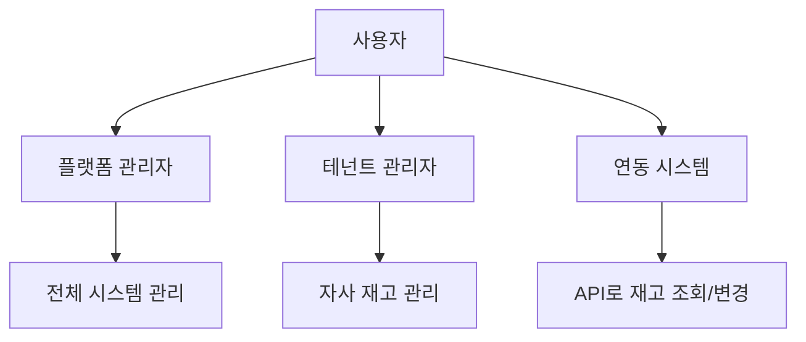

# 재고 관리 플랫폼 PRD (Product Requirements Document)

> **프로젝트 유형**: 별도 SaaS 플랫폼  
> **작성일**: 2025-12-22  
> **수정일**: 2025-12-24  
> **연관 프로젝트**: Shopping Mall (API 연동 예정)

---

## 1. 프로젝트 개요

| 항목 | 내용 |
|------|------|
| **프로젝트 이름** | Inventory Management Platform (재고 관리 플랫폼) |
| **목표** | 온라인/오프라인 통합 재고 관리 SaaS |
| **타겟 사용자** | 쇼핑몰 운영자, 오프라인 매장, 물류 관리자 |
| **비즈니스 모델** | B2B SaaS (API 기반 서비스 제공) |
| **기술 스택** | Node.js + Express + MongoDB (또는 PostgreSQL) |

---

## 2. 문제 정의

### 현재 문제점
- 온라인 쇼핑몰과 오프라인 매장의 재고가 따로 관리됨
- 실시간 재고 동기화 부재로 과잉판매(overselling) 발생
- 여러 채널의 재고 현황을 한눈에 파악하기 어려움
- 재고 변동 이력 추적 불가

### 해결 목표
- 단일 플랫폼에서 모든 채널의 재고 통합 관리
- API를 통해 다양한 시스템과 연동 가능
- 실시간 재고 동기화 및 알림

---

## 3. 사용자 유형



| 역할 | 설명 | 권한 |
|------|------|------|
| **플랫폼 관리자** | 시스템 전체 관리 | 테넌트 관리, 시스템 설정 |
| **테넌트 관리자** | 고객사 담당자 | 자사 재고 관리, API 키 발급 |
| **연동 시스템** | 쇼핑몰, POS 등 | API로 재고 조회/변경 |

---

## 4. 핵심 기능

### 4.1 멀티테넌트 관리

| 기능 | 설명 |
|------|------|
| 테넌트 생성 | 고객사별 독립 공간 생성 |
| API 키 발급 | 테넌트별 API 인증 키 관리 |
| 사용량 추적 | API 호출 횟수, 재고 수량 등 |

### 4.2 상품/SKU 관리

| 기능 | 설명 |
|------|------|
| SKU 등록 | 상품 고유 코드 등록 |
| 상품 정보 | 이름, 카테고리, 속성 등 |
| 외부 연결 | 외부 시스템의 상품 ID 매핑 |

#### 📐 하이브리드 필드 관리 시스템

> **설계 방식**: 공통 필드 + 카테고리 템플릿 + 테넌트 커스터마이징

```
┌─────────────────────────────────────────────────────┐
│                    Product                           │
├─────────────────────────────────────────────────────┤
│  🔒 공통 필드 (모든 상품 필수)                        │
│  - SKU, 바코드, 상품명, 가격, 이미지 등               │
├─────────────────────────────────────────────────────┤
│  📋 카테고리 템플릿 (미리 정의된 필드 세트)            │
│  - 식품 템플릿: 유통기한, 알레르기, 영양성분...        │
│  - 화장품 템플릿: 전성분, 사용기한, PAO...            │
│  - 의류 템플릿: 사이즈, 컬러, 소재...                 │
├─────────────────────────────────────────────────────┤
│  ⚙️ 테넌트 설정 (고객사별 커스터마이징)               │
│  - 사용할 필드 선택 ✅                               │
│  - 필드 순서 변경 ↕                                  │
│  - 커스텀 필드 추가 ➕                               │
│  - 필드 숨김/표시 👁                                │
└─────────────────────────────────────────────────────┘
```

#### 공통 필드 (Core Fields) - 모든 상품 필수

| 필드 | 필수 | 타입 | 설명 |
|------|:----:|------|------|
| **상품 코드 (SKU)** | ✅ | String | 내부 관리용 고유 코드 |
| **바코드** | ✅ | String | JAN/EAN 바코드 |
| **상품명** | ✅ | Object | 다국어 지원 (일본어/한국어/영어) |
| **브랜드** | ✅ | String | 제조사/브랜드명 |
| **카테고리** | ✅ | String | 상품 분류 |
| **판매가** | ✅ | Number | 소비자 판매가격 |
| **원가** | - | Number | 매입 원가 |
| **세금 구분** | ✅ | Enum | 경감세율(8%)/표준세율(10%) |
| **원산지** | ✅ | String | 제조 원산지 |
| **메인 이미지** | ✅ | String | 상품 대표 이미지 |
| **서브 이미지** | - | Array | 추가 이미지들 |
| **판매 상태** | ✅ | Enum | 판매중/일시중지/판매종료 |
| **입수** | ✅ | Number | 케이스당 수량 |
| **외부 ID** | - | Object | 외부 플랫폼 연동용 ID |

#### 카테고리 템플릿

| 템플릿 | 카테고리 | 주요 추가 필드 |
|--------|---------|---------------|
| **식품** | 한국식품 | 유통기한, 알레르기(28품목), 영양성분, 보관방법 |
| **화장품** | K-Beauty | 사용기한, PAO, 전성분, 분류(화장품/의약부외품) |
| **의류** | K-Fashion | 사이즈 옵션, 컬러 옵션, 소재(혼용률), 세탁표시 |
| **커스텀** | 기타 | 테넌트가 직접 정의 |

#### 테넌트별 필드 설정

```javascript
// 데이터 모델: TenantFieldConfig
{
  tenant: ObjectId,
  template: 'food' | 'cosmetic' | 'clothing' | 'custom',
  
  // 필드 활성화 설정
  enabledFields: [
    { fieldKey: 'expiryDate', enabled: true, required: true },
    { fieldKey: 'allergens', enabled: true, required: true },
    { fieldKey: 'nutrition', enabled: false, required: false },
    // ...
  ],
  
  // 필드 표시 순서
  fieldOrder: ['sku', 'barcode', 'name', 'expiryDate', ...],
  
  // 커스텀 필드
  customFields: [
    {
      key: 'supplier',
      label: { ja: '仕入先', ko: '수입처' },
      type: 'string',
      required: false
    }
  ]
}
```

#### 필드 설정 UI (관리자 화면)

```
┌─────────────────────────────────────────────────────┐
│  📋 상품 필드 설정                                   │
├─────────────────────────────────────────────────────┤
│  템플릿: [식품 ▼]                                   │
├─────────────────────────────────────────────────────┤
│  공통 필드 (변경 불가)                               │
│  ├── ✅ 상품 코드 (필수)                            │
│  ├── ✅ 바코드 (필수)                               │
│  └── ✅ 상품명 (필수)                               │
├─────────────────────────────────────────────────────┤
│  선택 필드                                          │
│  ├── ☑ 유통기한      [필수 ▼]                      │
│  ├── ☑ 알레르기 정보  [필수 ▼]                      │
│  ├── ☐ 영양 성분      [선택 ▼] ← 비활성화           │
│  └── ☑ 보관 방법      [선택 ▼]                      │
├─────────────────────────────────────────────────────┤
│  커스텀 필드                                         │
│  └── ☑ 수입처        [선택 ▼] ← 직접 추가           │
├─────────────────────────────────────────────────────┤
│  [+ 커스텀 필드 추가]  [↕ 순서 변경]  [💾 저장]      │
└─────────────────────────────────────────────────────┘
```

#### 필드 관리 API

```
# 필드 설정
GET    /api/field-config              - 현재 필드 설정 조회
PUT    /api/field-config              - 필드 설정 저장
POST   /api/field-config/custom       - 커스텀 필드 추가
DELETE /api/field-config/custom/:key  - 커스텀 필드 삭제

# 템플릿
GET    /api/templates                 - 사용 가능한 템플릿 목록
GET    /api/templates/:type           - 템플릿 상세 (필드 목록)
```


### 4.2.1 한국식품 상품 정보 요구사항

> **관리 대상**: 한국식품 (일본 시장 판매용)

#### 기본 정보

| 필드 | 필수 | 설명 |
|------|:----:|------|
| **상품 코드 (SKU)** | ✅ | 내부 관리용 고유 코드 |
| **바코드 (JAN/EAN)** | ✅ | 바코드 스캔용 |
| **상품명 (일본어)** | ✅ | 판매용 일본어 상품명 |
| **상품명 (한국어)** | - | 내부 관리용 한국어명 |
| **상품명 (영어)** | - | 영문 표기 |
| **브랜드** | ✅ | 제조사/브랜드명 |
| **카테고리** | ✅ | 상품 분류 |

#### 가격 정보

| 필드 | 필수 | 설명 |
|------|:----:|------|
| **판매가 (엔화)** | ✅ | 소비자 판매가격 |
| **원가** | - | 매입 원가 |
| **세금 구분** | ✅ | 경감세율(8%) / 표준세율(10%) |

#### 상품 속성

| 필드 | 필수 | 설명 |
|------|:----:|------|
| **원산지** | ✅ | 한국 (韓国産) |
| **중량/용량** | ✅ | 예: 500g, 1L |
| **입수 (케이스당 수량)** | ✅ | 박스당 몇 개 들이인지 |
| **규격** | - | 크기, 포장 형태 등 |

#### 유통/보관 정보

| 필드 | 필수 | 설명 |
|------|:----:|------|
| **보관 방법** | ✅ | 상온 / 냉장 / 냉동 |
| **유통기한 기본값** | - | 제조일로부터 기본 유통기한 (예: 180일) |
| **보관 온도** | - | 예: 0~10℃ |
| **취급 주의사항** | - | 직사광선 피할 것 등 |

#### 식품 표시 정보 (일본 법규 대응)

| 필드 | 필수 | 설명 |
|------|:----:|------|
| **원재료명** | ✅ | 일본어 표기 필요 |
| **알레르기 정보** | ✅ | 특정 7품목 + 권장 21품목 |
| **영양 성분** | ✅ | 열량, 단백질, 지방, 탄수화물, 나트륨 등 |
| **첨가물** | - | 사용된 첨가물 목록 |
| **유전자 변형 여부** | - | GMO 표시 |

#### 알레르기 표시 (일본 기준)

**특정원재료 7품목 (표시 의무)**
- 밀, 메밀, 달걀, 우유, 땅콩, 새우, 게

**특정원재료에 준하는 21품목 (표시 권장)**
- 아몬드, 전복, 오징어, 연어알, 오렌지, 캐슈넛, 키위, 소고기, 호두, 참깨, 연어, 고등어, 대두, 닭고기, 바나나, 돼지고기, 송이버섯, 복숭아, 참마, 사과, 젤라틴

#### 이미지/미디어

| 필드 | 필수 | 설명 |
|------|:----:|------|
| **메인 이미지** | ✅ | 상품 대표 이미지 |
| **서브 이미지** | - | 추가 이미지 (여러 장) |
| **원재료 라벨 이미지** | - | 뒷면 라벨 사진 |

#### 판매 채널 정보

| 필드 | 필수 | 설명 |
|------|:----:|------|
| **메이크샵 상품번호** | - | 외부 연동용 |
| **야후쇼핑 상품코드** | - | 외부 연동용 |
| **아마존 ASIN** | - | 외부 연동용 |
| **라쿠텐 상품번호** | - | 외부 연동용 |

#### 상태 관리

| 필드 | 필수 | 설명 |
|------|:----:|------|
| **판매 상태** | ✅ | 판매중 / 일시중지 / 판매종료 |
| **재고 상태** | 자동 | 재고있음 / 품절 / 입고예정 |
| **등록일** | 자동 | 상품 등록 일시 |
| **수정일** | 자동 | 최종 수정 일시 |

#### 기타

| 필드 | 필수 | 설명 |
|------|:----:|------|
| **상세 설명** | - | 상품 상세 정보 (HTML) |
| **검색 키워드** | - | 내부 검색용 태그 |
| **메모** | - | 관리자용 메모 |

### 4.2.2 한국화장품 상품 정보 요구사항

> **관리 대상**: 한국 화장품/K-Beauty (일본 시장 판매용)

#### 기본 정보

| 필드 | 필수 | 설명 |
|------|:----:|------|
| **상품 코드 (SKU)** | ✅ | 내부 관리용 고유 코드 |
| **바코드 (JAN/EAN)** | ✅ | 바코드 스캔용 |
| **상품명 (일본어)** | ✅ | 판매용 일본어 상품명 |
| **상품명 (한국어)** | - | 내부 관리용 한국어명 |
| **상품명 (영어)** | - | 영문 표기 |
| **브랜드** | ✅ | 제조사/브랜드명 |
| **시리즈/라인** | - | 제품 라인명 (예: 설화수 자음생) |
| **카테고리** | ✅ | 상품 분류 |

#### 화장품 카테고리

| 대분류 | 중분류 예시 |
|--------|------------|
| **스킨케어** | 토너, 에센스, 세럼, 크림, 아이크림, 마스크팩 |
| **메이크업** | 파운데이션, 립스틱, 아이섀도, 마스카라 |
| **클렌징** | 클렌징폼, 클렌징오일, 클렌징워터 |
| **선케어** | 선크림, 선스틱, 선쿠션 |
| **바디케어** | 바디로션, 바디워시, 핸드크림 |
| **헤어케어** | 샴푸, 트리트먼트, 헤어에센스 |
| **남성용** | 올인원, 쉐이빙 |

#### 가격 정보

| 필드 | 필수 | 설명 |
|------|:----:|------|
| **판매가 (엔화)** | ✅ | 소비자 판매가격 |
| **원가** | - | 매입 원가 |
| **세금 구분** | ✅ | 표준세율 10% |

#### 상품 속성

| 필드 | 필수 | 설명 |
|------|:----:|------|
| **원산지** | ✅ | 한국 (韓国製) |
| **용량** | ✅ | 예: 50ml, 30g |
| **제형** | - | 크림, 로션, 젤, 오일 등 |
| **피부 타입** | - | 건성, 지성, 복합성, 민감성, 모든피부 |
| **입수 (케이스당 수량)** | ✅ | 박스당 몇 개 들이인지 |

#### 유통/보관 정보

| 필드 | 필수 | 설명 |
|------|:----:|------|
| **사용기한** | ✅ | 제조일로부터 사용기한 (예: 36개월) |
| **개봉 후 사용기한** | - | PAO (Period After Opening) - 예: 12M |
| **보관 방법** | - | 직사광선 피하고 서늘한 곳 |
| **제조일자** | - | 로트별 제조일 |

#### 화장품 법규 정보 (일본 약기법 대응)

| 필드 | 필수 | 설명 |
|------|:----:|------|
| **화장품 분류** | ✅ | 化粧品 / 医薬部外品 |
| **전성분 (일본어)** | ✅ | 일본어 INCI 표기 |
| **사용 방법** | ✅ | 일본어 사용법 |
| **사용상 주의사항** | ✅ | 일본어 주의사항 |
| **제조판매원** | ✅ | 일본 내 제조판매 책임업체 |
| **원산국** | ✅ | 韓国 |

#### 알레르기/주의 성분

| 분류 | 내용 |
|------|------|
| **알레르기 유발 가능 성분** | 향료, 색소 등 |
| **사용 주의 성분** | 레티놀, AHA/BHA, 하이드로퀴논 등 |
| **비건 여부** | 동물성 원료 미사용 여부 |
| **무첨가 정보** | 파라벤프리, 무향료, 무색소 등 |

#### 이미지/미디어

| 필드 | 필수 | 설명 |
|------|:----:|------|
| **메인 이미지** | ✅ | 상품 대표 이미지 |
| **서브 이미지** | - | 추가 이미지 (여러 장) |
| **성분 표시 이미지** | - | 전성분 표시 라벨 |
| **텍스처 이미지** | - | 제형/발색 이미지 |

#### 판매 채널 정보

| 필드 | 필수 | 설명 |
|------|:----:|------|
| **메이크샵 상품번호** | - | 외부 연동용 |
| **야후쇼핑 상품코드** | - | 외부 연동용 |
| **아마존 ASIN** | - | 외부 연동용 |
| **라쿠텐 상품번호** | - | 외부 연동용 |
| **Qoo10 상품번호** | - | K-Beauty 인기 채널 |

#### 상태 관리

| 필드 | 필수 | 설명 |
|------|:----:|------|
| **판매 상태** | ✅ | 판매중 / 일시중지 / 판매종료 |
| **재고 상태** | 자동 | 재고있음 / 품절 / 입고예정 |
| **한정판 여부** | - | 한정판 / 시즌 한정 |
| **등록일** | 자동 | 상품 등록 일시 |
| **수정일** | 자동 | 최종 수정 일시 |

#### 기타

| 필드 | 필수 | 설명 |
|------|:----:|------|
| **상세 설명** | - | 상품 상세 정보 (HTML) |
| **효능/효과** | - | 주요 효능 (보습, 미백, 주름개선 등) |
| **검색 키워드** | - | 내부 검색용 태그 |
| **메모** | - | 관리자용 메모 |


### 4.2.3 의류 상품 정보 요구사항

> **관리 대상**: 의류/패션 아이템 (K-Fashion)

#### 기본 정보

| 필드 | 필수 | 설명 |
|------|:----:|------|
| **상품 코드 (SKU)** | ✅ | 내부 관리용 고유 코드 |
| **바코드 (JAN/EAN)** | ✅ | 바코드 스캔용 |
| **상품명 (일본어)** | ✅ | 판매용 일본어 상품명 |
| **상품명 (한국어)** | - | 내부 관리용 한국어명 |
| **브랜드** | ✅ | 브랜드명 |
| **카테고리** | ✅ | 상품 분류 |
| **시즌** | - | SS(봄여름) / FW(가을겨울) / 연중 |

#### 의류 카테고리

| 대분류 | 중분류 예시 |
|--------|------------|
| **아우터** | 코트, 재킷, 점퍼, 패딩, 가디건 |
| **상의** | 티셔츠, 셔츠, 블라우스, 니트, 후드 |
| **하의** | 바지, 청바지, 스커트, 쇼츠 |
| **원피스** | 롱원피스, 미니원피스, 점프수트 |
| **정장** | 수트, 블레이저, 슬랙스 |
| **스포츠웨어** | 레깅스, 운동복, 요가복 |
| **언더웨어** | 속옷, 양말, 홈웨어 |
| **악세서리** | 가방, 모자, 스카프, 벨트 |
| **신발** | 스니커즈, 부츠, 샌들, 힐 |

#### 가격 정보

| 필드 | 필수 | 설명 |
|------|:----:|------|
| **판매가 (엔화)** | ✅ | 소비자 판매가격 |
| **원가** | - | 매입 원가 |
| **세금 구분** | ✅ | 표준세율 10% |

#### 옵션 (사이즈/컬러)

| 필드 | 필수 | 설명 |
|------|:----:|------|
| **사이즈 옵션** | ✅ | XS, S, M, L, XL, XXL 또는 Free |
| **컬러 옵션** | ✅ | 색상 목록 (일본어 표기) |
| **옵션별 SKU** | ✅ | 사이즈/컬러 조합별 고유 SKU |
| **옵션별 재고** | ✅ | 각 옵션별 재고 수량 |
| **옵션별 바코드** | - | 옵션별 개별 바코드 |

#### 사이즈 정보

| 필드 | 필수 | 설명 |
|------|:----:|------|
| **사이즈 표기** | ✅ | S/M/L 또는 숫자 (55, 66, 77...) |
| **실측 사이즈** | - | 어깨, 가슴, 허리, 엉덩이, 총장 등 (cm) |
| **모델 착용 정보** | - | 모델 키/체중, 착용 사이즈 |

#### 상품 속성

| 필드 | 필수 | 설명 |
|------|:----:|------|
| **원산지** | ✅ | 한국, 중국, 베트남 등 |
| **소재 (혼용률)** | ✅ | 예: 면 60%, 폴리에스터 40% |
| **핏** | - | 레귤러핏, 오버핏, 슬림핏 |
| **두께감** | - | 얇음, 보통, 두꺼움 |
| **신축성** | - | 없음, 약간 있음, 좋음 |
| **안감** | - | 있음 / 없음 / 부분안감 |
| **투명도** | - | 비침 없음 / 약간 비침 / 비침 있음 |
| **입수 (케이스당 수량)** | ✅ | 박스당 몇 개 들이인지 |

#### 의류 표시법 정보 (일본 가정용품 품질표시법)

| 필드 | 필수 | 설명 |
|------|:----:|------|
| **섬유 조성 (일본어)** | ✅ | 예: 綿60%、ポリエステル40% |
| **세탁 표시** | ✅ | 일본 JIS 세탁 기호 |
| **원산국** | ✅ | 韓国製, 中国製 등 |
| **취급 주의사항** | - | 세탁/건조 주의사항 |
| **표시자** | ✅ | 일본 내 표시 책임자 |

#### 세탁 기호 (JIS L 0001)

| 분류 | 예시 |
|------|------|
| **세탁** | 물세탁 가능/불가, 온도 제한 |
| **표백** | 표백 가능/불가 |
| **건조** | 텀블건조 가능/불가, 자연건조 |
| **다림질** | 다림질 온도 |
| **드라이클리닝** | 가능/불가 |

#### 이미지/미디어

| 필드 | 필수 | 설명 |
|------|:----:|------|
| **메인 이미지** | ✅ | 상품 대표 이미지 |
| **서브 이미지** | - | 다각도 이미지 (여러 장) |
| **상세 이미지** | - | 소재, 디테일 클로즈업 |
| **착용 이미지** | - | 모델 착용샷 |
| **컬러별 이미지** | ✅ | 각 컬러 옵션별 이미지 |

#### 판매 채널 정보

| 필드 | 필수 | 설명 |
|------|:----:|------|
| **메이크샵 상품번호** | - | 외부 연동용 |
| **야후쇼핑 상품코드** | - | 외부 연동용 |
| **아마존 ASIN** | - | 외부 연동용 |
| **라쿠텐 상품번호** | - | 외부 연동용 |
| **ZOZOTOWN 상품코드** | - | 일본 패션 전문 채널 |

#### 상태 관리

| 필드 | 필수 | 설명 |
|------|:----:|------|
| **판매 상태** | ✅ | 판매중 / 일시중지 / 판매종료 |
| **재고 상태** | 자동 | 재고있음 / 품절 / 입고예정 |
| **시즌 상품** | - | 정규 / 시즌한정 / 리미티드 |
| **등록일** | 자동 | 상품 등록 일시 |
| **수정일** | 자동 | 최종 수정 일시 |

#### 기타

| 필드 | 필수 | 설명 |
|------|:----:|------|
| **상세 설명** | - | 상품 상세 정보 (HTML) |
| **스타일링 팁** | - | 코디 제안 |
| **검색 키워드** | - | 내부 검색용 태그 |
| **메모** | - | 관리자용 메모 |


### 4.3 창고/매장 관리

| 기능 | 설명 |
|------|------|
| 위치 등록 | 온라인 창고, 오프라인 매장 등록 |
| 위치별 재고 | 각 위치의 개별 재고 관리 |
| 위치 유형 | `warehouse`, `store`, `online` |

### 4.4 재고 관리 (핵심)

| 기능 | 설명 |
|------|------|
| 재고 조회 | SKU별, 위치별 재고 확인 |
| 재고 예약 | 주문 시 임시 홀딩 |
| 재고 확정 | 결제 완료 시 실제 차감 |
| 재고 복구 | 취소/환불 시 복원 |
| 재고 이동 | 위치 간 재고 이전 |
| 재고 조정 | 수동 재고 보정 |

### 4.5 알림 시스템

| 기능 | 설명 |
|------|------|
| 저재고 알림 | 설정 수량 이하 시 알림 |
| 품절 알림 | 재고 0 도달 시 알림 |
| Webhook | 연동 시스템에 실시간 이벤트 전송 |

### 4.6 대시보드

| 기능 | 설명 |
|------|------|
| 전체 현황 | 총 재고, 위치별 분포 |
| 저재고 목록 | 주의가 필요한 상품 |
| 변동 이력 | 최근 재고 변동 내역 |
| 통계 | 회전율, 판매 추이 등 |

---

## 5. API 설계 (초안)

### 5.1 인증
```
POST /api/auth/token     - API 토큰 발급
```

### 5.2 상품 (Products)
```
GET    /api/products           - 상품 목록
POST   /api/products           - 상품 등록
GET    /api/products/:sku      - 상품 상세
PUT    /api/products/:sku      - 상품 수정
DELETE /api/products/:sku      - 상품 삭제
```

### 5.3 위치 (Locations)
```
GET    /api/locations          - 위치 목록
POST   /api/locations          - 위치 등록
GET    /api/locations/:id      - 위치 상세
PUT    /api/locations/:id      - 위치 수정
```

### 5.4 재고 (Inventory) - 핵심 API
```
GET    /api/inventory                    - 전체 재고 조회
GET    /api/inventory/:sku               - SKU별 재고 조회
GET    /api/inventory/:sku/:locationId   - 특정 위치 재고

POST   /api/inventory/reserve            - 재고 예약 (주문시)
POST   /api/inventory/confirm            - 재고 확정 (결제후)
POST   /api/inventory/release            - 재고 복구 (취소시)
POST   /api/inventory/transfer           - 재고 이동
POST   /api/inventory/adjust             - 재고 조정
```

### 5.5 이력 (Logs)
```
GET    /api/logs                - 변동 이력 조회
GET    /api/logs/:sku           - SKU별 이력
```

### 5.6 Webhook
```
POST   /api/webhooks           - Webhook 등록
GET    /api/webhooks           - Webhook 목록
DELETE /api/webhooks/:id       - Webhook 삭제
```

---

## 6. 데이터 모델 (초안)

### Tenant (테넌트/고객사)
```
- name: 회사명
- apiKey: API 키
- plan: 요금제
- isActive: 활성화
```

### Product (상품)
```
- tenant: 테넌트 참조
- sku: 상품 코드 (unique per tenant)
- name: 상품명
- category: 카테고리
- attributes: { 색상, 사이즈, ... }
- externalIds: { // 각 플랫폼별 고유 식별값 매핑
    makeshop: String,  // 메이크샵 상품번호
    yahoo: String,     // 야후 쇼핑 상품/서브코드
    amazon: String,    // 아마존 ASIN/SKU
    rakuten: String    // 라쿠텐 상품번호
  }
```

### Location (위치/창고/매장)
```
- tenant: 테넌트 참조
- name: 위치명
- type: 'warehouse' | 'store' | 'online'
- address: 주소
- isActive: 활성화
```

### Inventory (재고)
```
- tenant: 테넌트 참조
- product: 상품 참조
- location: 위치 참조
- available: 가용 재고
- reserved: 예약된 재고
- lowStockThreshold: 저재고 기준
```

### InventoryLog (재고 이력)
```
- inventory: 재고 참조
- type: 'order' | 'return' | 'transfer' | 'adjust' | 'sale'
- quantity: 변동 수량 (+/-)
- reference: 주문번호 등
- reason: 사유
- createdBy: 작업자
- createdAt: 시간
```

### Webhook
```
- tenant: 테넌트 참조
- url: 콜백 URL
- events: ['stock_low', 'out_of_stock', ...]
- isActive: 활성화
```

---

## 7. 쇼핑몰 연동 시나리오

### 7.1 상품 페이지 조회
```
쇼핑몰 → GET /api/inventory/PROD001
← { sku: 'PROD001', available: 50, reserved: 5 }
```

### 7.2 주문 프로세스
```
[1] 결제 시작
쇼핑몰 → POST /api/inventory/reserve
{ sku: 'PROD001', quantity: 2, orderId: 'ORD-001' }
← { success: true, reservationId: 'RES-xxx' }

[2] 결제 성공
쇼핑몰 → POST /api/inventory/confirm
{ reservationId: 'RES-xxx' }
← { success: true, newAvailable: 48 }

[3] 결제 실패/취소
쇼핑몰 → POST /api/inventory/release
{ reservationId: 'RES-xxx' }
← { success: true, restored: 2 }
```

### 7.3 Webhook 수신
```
재고 플랫폼 → POST (쇼핑몰 webhook URL)
{
  "event": "stock_low",
  "sku": "PROD001",
  "available": 3,
  "threshold": 5
}
```

---

## 8. 외부 플랫폼 연동

### 8.1 연동 아키텍처

```
┌─────────────────────────────────────────────────────────┐
│              재고 관리 플랫폼 (Core)                      │
├─────────────────────────────────────────────────────────┤
│                    연동 플러그인                          │
│  ┌──────────┐ ┌──────────┐ ┌──────────┐ ┌──────────┐   │
│  │ MakeShop │ │  Yahoo   │ │  Amazon  │ │ Rakuten  │   │
│  │ 메이크샵  │ │ 야후쇼핑  │ │  아마존   │ │  라쿠텐   │   │
│  └──────────┘ └──────────┘ └──────────┘ └──────────┘   │
│        테넌트별 활성화/비활성화 가능                       │
└─────────────────────────────────────────────────────────┘
```

### 8.2 테넌트별 연동 설정

```javascript
// 데이터 모델: TenantIntegration
{
  tenant: ObjectId,
  platform: 'makeshop' | 'yahoo' | 'amazon' | 'rakuten',
  enabled: Boolean,
  credentials: {
    apiKey: String,
    secretKey: String,
    shopId: String,      // 플랫폼별 상점 ID
    // ... 기타 인증 정보
  },
  settings: {
    autoSync: Boolean,   // 자동 재고 동기화
    syncInterval: Number // 동기화 주기 (분)
  }
}
```

### 8.3 플랫폼별 연동 요구사항

| 플랫폼 | 연동 방식 | 주요 기능 | 우선순위 |
|--------|----------|----------|:--------:|
| **메이크샵** | REST API | 상품 조회, 재고 업데이트 | 🥇 1순위 |
| **야후쇼핑** | REST API | 상품 조회, 재고/가격 업데이트 | 🥇 1순위 |
| **아마존** | SP-API | 상품 조회, 재고 업데이트 | 🥈 2순위 |
| **라쿠텐** | RMS API | 상품 조회, 재고 업데이트 | 🥈 2순위 |

### 8.4 공통 연동 인터페이스

```javascript
// 모든 플랫폼 연동 모듈은 이 인터페이스를 구현
interface PlatformConnector {
  // 연결 테스트
  testConnection(): Promise<boolean>
  
  // 상품 동기화
  fetchProducts(): Promise<Product[]>
  
  // 재고 조회
  getStock(externalId: string): Promise<number>
  
  // 재고 업데이트
  updateStock(externalId: string, quantity: number): Promise<boolean>
  
  // 주문 조회 (선택)
  fetchOrders(): Promise<Order[]>
}
```

### 8.5 연동 시나리오

**A. 재고 자동 동기화 (플랫폼 → 재고관리)**
```
[1] 외부 플랫폼에서 주문 발생
[2] Webhook 또는 폴링으로 감지
[3] 재고 플랫폼에 반영
[4] 다른 연동 플랫폼에 재고 업데이트
```

**B. 재고 Push (재고관리 → 플랫폼)**
```
[1] 재고 플랫폼에서 재고 변경
[2] 활성화된 모든 플랫폼에 재고 업데이트 API 호출
```

### 8.6 플랫폼별 API 정보 (참고)

| 플랫폼 | API 문서 | 인증 방식 |
|--------|----------|----------|
| 메이크샵 | [MakeShop API](https://www.makeshop.co.kr/) | API Key |
| 야후쇼핑 | [Yahoo Shopping API](https://developer.yahoo.co.jp/) | OAuth 2.0 |
| 아마존 | [Amazon SP-API](https://developer-docs.amazon.com/sp-api/) | AWS Signature |
| 라쿠텐 | [Rakuten RMS](https://webservice.rms.rakuten.co.jp/) | Service Secret |

### 8.7 연동 관리 API

```
GET    /api/integrations              - 연동 목록
POST   /api/integrations              - 연동 추가
PUT    /api/integrations/:id          - 연동 설정 변경
DELETE /api/integrations/:id          - 연동 삭제
POST   /api/integrations/:id/test     - 연결 테스트
POST   /api/integrations/:id/sync     - 수동 동기화
```

---

## 9. 입출고 프로세스

### 9.1 입고 프로세스 흐름

```
[1] 상품 도착 → 수입처 선택/입력
[2] 바코드 스캔
    ├── 상품 있음 → 기존 데이터 불러오기
    │   - 입고일: 자동 (현재 날짜)
    │   - 상미기간: 직접 날짜 입력 (상품마다 다름)
    │   - 상품명: 입력 
    │   - 수량: 낱개 + BOX 입력
    │   - 창고 위치: 선택
    │   - 메모: 선택 입력
    │
    └── 상품 없음 → 신규 상품
        - 모든 필드 수동 입력

[3] 저장 → 재고 시스템에 실시간 반영 (로트 생성)
```

### 9.2 입고 데이터 모델 (InventoryLot)

```javascript
{
  tenant: ObjectId,
  sku: "PROD001",
  lotNumber: "LOT-20231223-001",   // 자동 생성
  
  // 입고 정보
  receivedDate: Date,               // 입고일 (자동)
  expiryDate: Date,                 // 상미기간
  supplier: "OO농장",               // 수입처
  
  // 수량 정보
  quantity: {
    units: 50,                      // 낱개 수량
    boxes: 10,                      // 박스 수
    unitsPerBox: 24                 // 박스당 수량
  },
  totalUnits: 290,                  // 자동계산: 50 + (10 × 24)
  remainingUnits: 290,              // 남은 수량 (출고 시 차감)
  
  // 창고 위치
  location: {
    warehouse: "A",                 // 창고
    zone: "C",                      // 구역
    shelf: "3"                      // 칸
  },
  
  // 기타
  memo: "일부 외관 손상",
  status: "available",              // available / reserved / depleted
  createdBy: ObjectId               // 입고 담당자
}
```

### 9.3 입고 화면 (바코드 기기)

```
┌─────────────────────────────────────┐
│  📦 입고                             │
├─────────────────────────────────────┤
│  바코드: [PROD001]        ✅ 스캔됨  │
│  상품명: 사과 (자동)                 │
├─────────────────────────────────────┤
│  수입처: [OO농장        ▼]          │
│  입고일: 2023-12-23 (자동)           │
│  상미기간: [2024-01-15    📅]        │
├─────────────────────────────────────┤
│  수량                                │
│  낱개: [  50  ]개                    │
│  박스: [  10  ]개 × [  24  ]개/박스  │
│  총 수량: 290개 (자동계산)            │
├─────────────────────────────────────┤
│  창고 위치                           │
│  창고: [A ▼] 구역: [C ▼] 칸: [3 ▼]  │
├─────────────────────────────────────┤
│  메모: [일부 외관 손상 있음______]    │
├─────────────────────────────────────┤
│         [취소]        [입고 완료]    │
└─────────────────────────────────────┘
```

### 9.4 출고 프로세스 흐름

```
[1] 출고 바코드 스캔
[2] 출고 수량 입력
[3] 시스템 자동 선택 (FEFO + FIFO)
    - 1순위: 상미기간 짧은 로트
    - 2순위: 같은 상미기간이면 먼저 입고된 로트
[4] 해당 로트에서 수량 차감
[5] 여러 로트에 걸쳐 출고 가능 (부분 출고)
```

### 9.5 출고 로직 예시

```
출고 요청: PROD001 × 100개

[자동 선택]
LOT-001: 상미기간 12/25, 재고 30개 → 30개 출고 (잔여 0)
LOT-002: 상미기간 12/28, 재고 50개 → 50개 출고 (잔여 0)
LOT-003: 상미기간 12/30, 재고 80개 → 20개 출고 (잔여 60)
─────────────────────────────────────────────
총 100개 출고 완료
```

### 9.6 입출고 API

```
# 입고
POST   /api/receiving              - 입고 등록
GET    /api/receiving              - 입고 이력 조회
GET    /api/receiving/:lotNumber   - 로트 상세

# 출고
POST   /api/shipping               - 출고 등록
GET    /api/shipping               - 출고 이력 조회

# 로트 관리
GET    /api/lots                   - 로트 목록
GET    /api/lots/:sku              - SKU별 로트 목록
GET    /api/lots/expiring          - 상미기간 임박 로트
```

### 9.7 알림 기능

| 알림 | 조건 | 대상 |
|------|------|------|
| **상미기간 7일 전** | expiryDate - 7일 | 관리자 |
| **상미기간 3일 전** | expiryDate - 3일 | 관리자 (긴급) |
| **상미기간 경과** | expiryDate < 오늘 | 관리자 (폐기 필요) |
| **저재고** | remainingUnits < threshold | 관리자 |

### 9.8 추가 기능 (선택)

| 기능 | 설명 | 우선순위 |
|------|------|:--------:|
| **상미기간 자동계산** | 상품별 기본 유통기한 설정 | 🥇 높음 |
| **로트 번호 자동생성** | LOT-YYYYMMDD-001 형식 | 🥇 높음 |
| **입고 검수** | 수량 체크, 불량 체크 단계 | 🥈 중간 |
| **사진 첨부** | 불량/특이사항 사진 기록 | 🥉 낮음 |
| **바코드 출력** | 로트별 바코드 라벨 출력 | 🥈 중간 |

---

## 10. 비기능 요구사항

| 항목 | 요구사항 |
|------|----------|
| **응답 시간** | API 평균 응답 < 200ms |
| **가용성** | 99.9% uptime |
| **동시성** | 동일 SKU 동시 주문 시 데이터 정합성 보장 |
| **보안** | API 키 인증, HTTPS, 요청 속도 제한 |
| **확장성** | 수평 확장 가능한 구조 |

---

## 11. 개발 로드맵

| Phase | 기간 | 목표 |
|:-----:|------|------|
| **1** | 2주 | 핵심 API (재고 CRUD, 예약/확정), 멀티테넌트 |
| **2** | 2주 | 상품 관리 (하이브리드 필드 시스템) |
| **3** | 2주 | 입출고 프로세스, 로트 관리 |
| **4** | 2주 | 외부 플랫폼 연동 (메이크샵, 야후) |
| **5** | 2주 | Webhook, 알림, 대시보드 |
| **6** | 2주 | 추가 플랫폼 연동 (아마존, 라쿠텐) + 테스트 |

---

## 12. 다음 단계

| 순서 | 작업 | 상태 |
|:----:|------|:----:|
| 1 | PRD (현재 문서) | ✅ |
| 2 | 기술 설계서 | ⏳ 대기 |
| 3 | 프로젝트 초기 설정 | ⏳ 대기 |
| 4 | Phase 1 개발 | ⏳ 대기 |

---

> 💡 **검토 요청**: 재고 관리 플랫폼의 요구사항이 비즈니스 니즈에 맞는지 확인해주세요!
