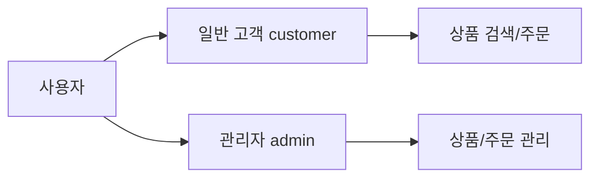

# 쇼핑몰 PRD (Product Requirements Document)

> **사용자 요청 내용**: 현재 쇼핑몰 프로젝트의 기존 코드를 분석하여 PRD 문서를 작성해달라는 요청

---

## 1. 프로젝트 개요

| 항목 | 내용 |
|------|------|
| **프로젝트 이름** | Shopping Mall |
| **목표** | 식품(일반/냉장/냉동) 온라인 판매 플랫폼 |
| **타겟 사용자** | 온라인 식품 구매 고객 + 매장 관리자 |
| **기술 스택** | React (Vite) + Node.js (Express) + MongoDB |
| **배포 환경** | Vercel (클라이언트) + Heroku (서버) + MongoDB Atlas |

---

## 2. 사용자 유형 및 역할



| 역할 | 권한 |
|------|------|
| **일반 고객** | 회원가입, 로그인, 상품 검색, 장바구니, 주문, 내 주문 조회 |
| **관리자** | 상품 CRUD, 주문 상태 관리, 전체 주문 조회 |

---

## 3. 핵심 기능 (현재 구현 상태)

### 3.1 사용자 기능

| 기능 | 상태 | 페이지 |
|------|:----:|--------|
| 회원가입 | ✅ | `SignupPage.jsx` |
| 로그인/로그아웃 | ✅ | `LoginPage.jsx` |
| 홈페이지 | ✅ | `HomePage.jsx` |
| 상품 상세 보기 | ✅ | `ProductDetailPage.jsx` |
| 장바구니 | ✅ | `CartPage.jsx` |
| 주문/결제 | ✅ | `OrderPage.jsx` |
| 주문 완료 | ✅ | `OrderCompletePage.jsx` |
| 주문 실패 | ✅ | `OrderFailPage.jsx` |
| 내 주문 조회 | ✅ | `MyOrdersPage.jsx` |

### 3.2 관리자 기능

| 기능 | 상태 | 페이지 |
|------|:----:|--------|
| 관리자 대시보드 | ✅ | `AdminPage.jsx` |
| 상품 목록 관리 | ✅ | `AdminProductsPage.jsx` |
| 상품 등록 | ✅ | `AdminProductCreatePage.jsx` |
| 상품 수정 | ✅ | `AdminProductEditPage.jsx` |
| 주문 관리 | ✅ | `AdminOrdersPage.jsx` |

---

## 4. 데이터 모델 (스키마)

### 4.1 User (사용자)

| 필드 | 타입 | 설명 |
|------|------|------|
| `email` | String | 이메일 (unique) |
| `name` | String | 이름 |
| `password` | String | 비밀번호 (bcrypt 해싱) |
| `user_type` | Enum | `customer` / `admin` |
| `address` | String | 주소 (선택) |

### 4.2 Product (상품)

| 필드 | 타입 | 설명 |
|------|------|------|
| `sku` | String | 상품 코드 (unique) |
| `name` | String | 상품명 |
| `price` | Number | 가격 |
| `category` | Enum | `일반` / `냉장` / `냉동` |
| `image` | String | 이미지 URL |
| `description` | String | 상품 설명 |
| `tags` | Array | 태그 목록 |

### 4.3 Cart (장바구니)

| 필드 | 타입 | 설명 |
|------|------|------|
| `user` | ObjectId | 사용자 참조 |
| `items` | Array | 상품 목록 (product, quantity) |

### 4.4 Order (주문)

| 필드 | 타입 | 설명 |
|------|------|------|
| `orderNumber` | String | 주문번호 (자동생성: ORD-YYYYMMDD-0001) |
| `user` | ObjectId | 주문자 |
| `items` | Array | 주문 상품 목록 |
| `shippingAddress` | Object | 배송지 정보 |
| `payment` | Object | 결제 정보 |
| `status` | Enum | 주문 상태 (아래 참조) |
| `totalAmount` | Number | 총 결제 금액 |
| `trackingNumber` | String | 운송장 번호 |

**주문 상태 흐름:**
```
pending → paid → preparing → shipping → delivered
                          ↘ cancelled
                          ↘ refund_requested → refunded
```

---

## 5. API 엔드포인트

### 5.1 인증 (Auth)
- `POST /api/auth/register` - 회원가입
- `POST /api/auth/login` - 로그인

### 5.2 사용자 (User)
- `GET /api/users/me` - 내 정보 조회
- `PUT /api/users/me` - 내 정보 수정

### 5.3 상품 (Product)
- `GET /api/products` - 상품 목록 (+ 페이지네이션)
- `GET /api/products/:id` - 상품 상세
- `POST /api/products` - 상품 등록 (관리자)
- `PUT /api/products/:id` - 상품 수정 (관리자)
- `DELETE /api/products/:id` - 상품 삭제 (관리자)

### 5.4 장바구니 (Cart)
- `GET /api/cart` - 장바구니 조회
- `POST /api/cart` - 장바구니 추가
- `PUT /api/cart/:itemId` - 수량 변경
- `DELETE /api/cart/:itemId` - 상품 제거

### 5.5 주문 (Order)
- `GET /api/orders` - 내 주문 목록
- `GET /api/orders/:id` - 주문 상세
- `POST /api/orders` - 주문 생성
- `PUT /api/orders/:id/status` - 주문 상태 변경 (관리자)
- `GET /api/orders/admin/all` - 전체 주문 조회 (관리자)

---

## 6. 결제 시스템

| 결제 수단 | 코드 |
|----------|------|
| 신용카드 | `card` |
| 계좌이체 | `bank_transfer` |
| 카카오페이 | `kakao_pay` |
| 네이버페이 | `naver_pay` |

> **참고**: 현재 결제 연동은 Mock 상태로 보임 (impUid, merchantUid 필드 존재)

---

## 7. 비기능 요구사항

| 항목 | 현재 상태 |
|------|----------|
| **반응형 디자인** | CSS로 구현 |
| **인증** | JWT 토큰 기반 |
| **비밀번호 보안** | bcrypt 해싱 |
| **CORS** | 배포 환경 설정 완료 |
| **환경 변수** | .env 파일 사용 |

---

## 8. 폴더 구조

```
📁 Shopping-mall
├── 📁 client/                 # React 프론트엔드
│   └── 📁 src/
│       ├── 📁 components/     # 재사용 컴포넌트 (16개)
│       ├── 📁 pages/          # 페이지 컴포넌트
│       │   └── 📁 admin/      # 관리자 페이지 (5개)
│       └── App.jsx            # 라우팅 설정
│
├── 📁 server/                 # Express 백엔드
│   └── 📁 src/
│       ├── 📁 models/         # MongoDB 스키마 (4개)
│       ├── 📁 routes/         # API 라우터 (6개)
│       ├── 📁 controllers/    # 비즈니스 로직 (5개)
│       └── 📁 middleware/     # 인증 미들웨어
│
└── 📁 docs/                   # 문서
```

---

## 9. 개선 예정 기능

> [!IMPORTANT]
> 아래 기능들은 향후 개발 예정인 기능들입니다.

### 9.1 🏪 재고 관리 시스템 (Inventory Management) - Phase 1

#### 개요
온라인 쇼핑몰과 오프라인 매장의 재고를 통합 관리하는 시스템

#### 핵심 요구사항

**A. 온라인 쇼핑몰 재고 관리**
| 기능 | 설명 |
|------|------|
| 상품별 재고 수량 | Product에 `stock` 필드 추가 |
| 재고 차감 | 주문 시 자동 재고 차감 |
| 재고 복구 | 주문 취소/환불 시 재고 복구 |
| 품절 처리 | 재고 0일 때 "품절" 표시, 주문 차단 |
| 저재고 알림 | 설정 수량 이하 시 관리자 알림 |

**B. 오프라인 매장 재고 관리**
| 기능 | 설명 |
|------|------|
| 매장 정보 | 매장(Store) 데이터 모델 추가 |
| 매장별 재고 | 각 매장의 개별 재고 관리 |
| 오프라인 판매 기록 | 매장 판매 시 재고 차감 |
| 매장 간 재고 이동 | 재고 이동 기록 및 추적 |

**C. 통합 재고 관리**
| 기능 | 설명 |
|------|------|
| 총 재고 현황 | 온라인 + 오프라인 전체 재고 조회 |
| 재고 동기화 | 실시간 재고 동기화 |
| 재고 이력 | 모든 재고 변동 이력 추적 |
| 재고 대시보드 | 통합 재고 현황 대시보드 |

#### 사용자 스토리

```
👤 고객으로서
- 상품 페이지에서 재고 상태(재고 있음/품절)를 확인할 수 있다
- 품절 상품은 장바구니에 담을 수 없다
- 결제 시 재고 부족하면 알림을 받는다

👑 관리자로서
- 상품 등록/수정 시 재고 수량을 입력할 수 있다
- 전체 재고 현황을 대시보드에서 확인할 수 있다
- 저재고 상품 목록을 볼 수 있다
- 오프라인 매장별 재고를 관리할 수 있다
- 매장 간 재고를 이동할 수 있다
- 재고 변동 이력을 조회할 수 있다
```

#### 예상 데이터 모델

```
Store (매장)
- name: 매장명
- location: 주소
- isActive: 활성화 여부

Inventory (재고)
- product: 상품 참조
- store: 매장 참조 (null = 온라인)
- quantity: 수량
- lowStockThreshold: 저재고 기준

InventoryLog (재고 이력)
- inventory: 재고 참조
- type: 'sale' | 'order' | 'return' | 'transfer' | 'adjustment'
- quantity: 변동 수량 (+/-)
- reason: 사유
- createdBy: 작업자
```

---

### 9.2 기타 개선 영역 (향후)

| 영역 | 현재 상태 | 개선 방향 | 우선순위 |
|------|----------|----------|:--------:|
| **검색 기능** | 기본 검색 | 필터링, 정렬 강화 | Phase 2 |
| **결제 연동** | Mock 상태 | PG사 실제 연동 | Phase 2 |
| **이미지 업로드** | URL 직접 입력 | 파일 업로드 | Phase 2 |
| **리뷰/평점** | 미구현 | 상품 리뷰 시스템 | Phase 3 |
| **위시리스트** | 미구현 | 찜 기능 | Phase 3 |
| **쿠폰/할인** | 미구현 | 프로모션 시스템 | Phase 3 |
| **알림** | 미구현 | 이메일/SMS 알림 | Phase 3 |

---

## 10. 다음 단계

| 순서 | 문서 | 상태 |
|:----:|------|:----:|
| 1 | PRD (현재 문서) | ✅ |
| 2 | 재고 관리 기술 설계서 | ⏳ 대기 |
| 3 | 구현 계획 | ⏳ 대기 |
| 4 | 개발 시작 | ⏳ 대기 |

---

> 💡 **검토 요청**: 재고 관리 시스템 요구사항이 비즈니스 니즈에 맞는지 확인해주세요!

