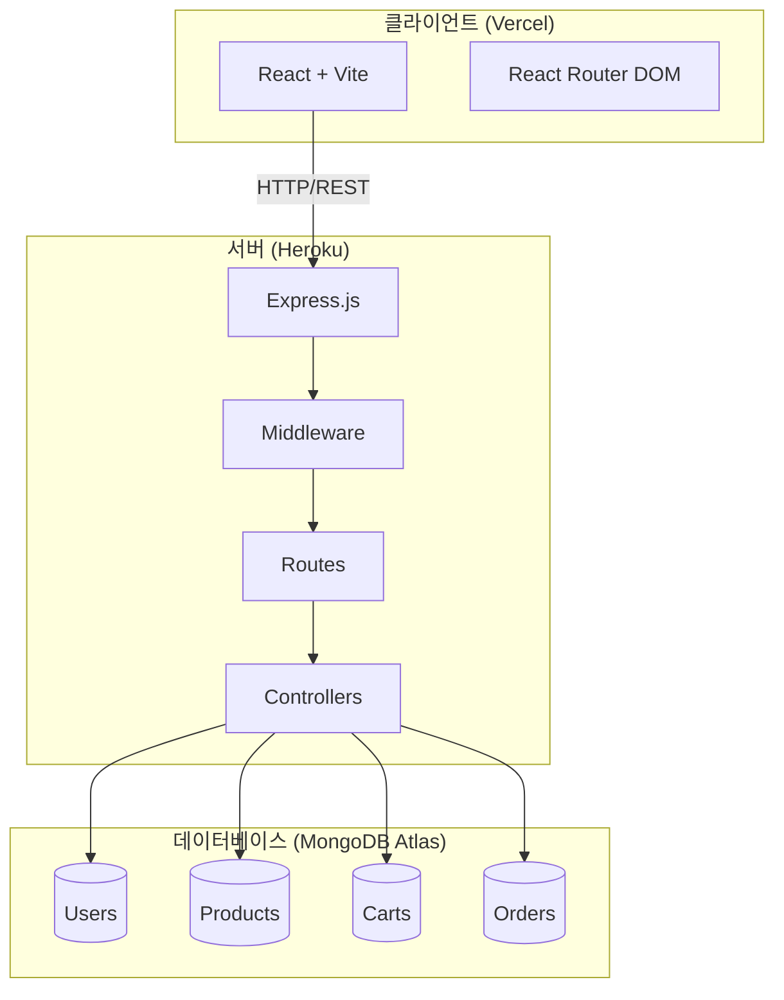
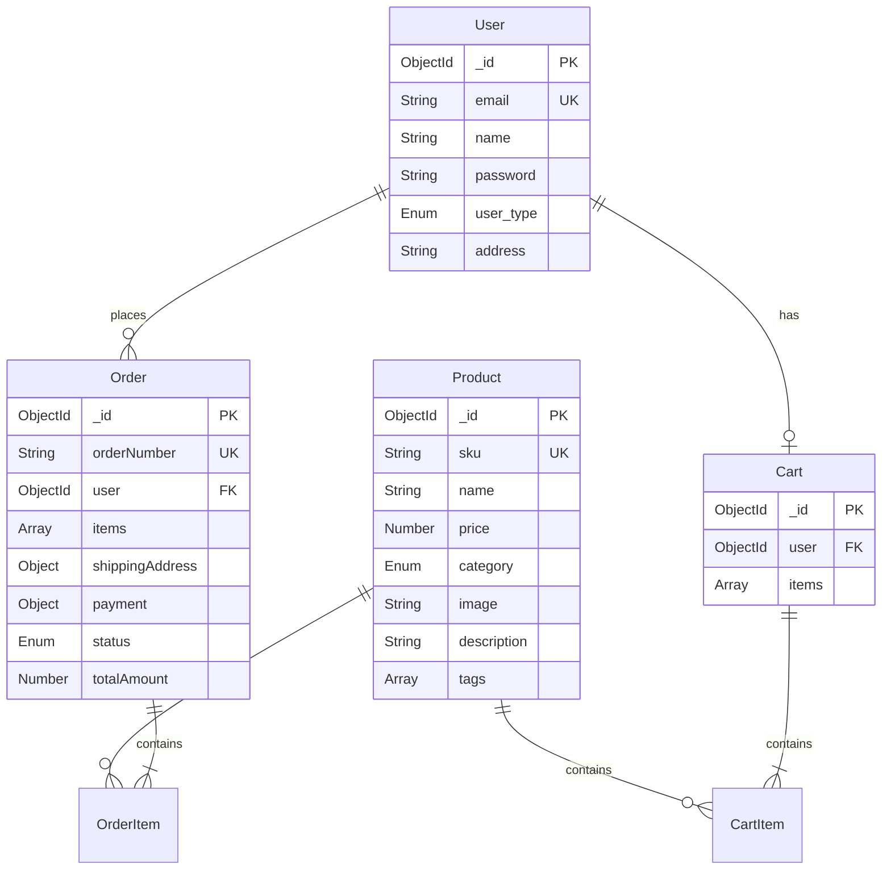
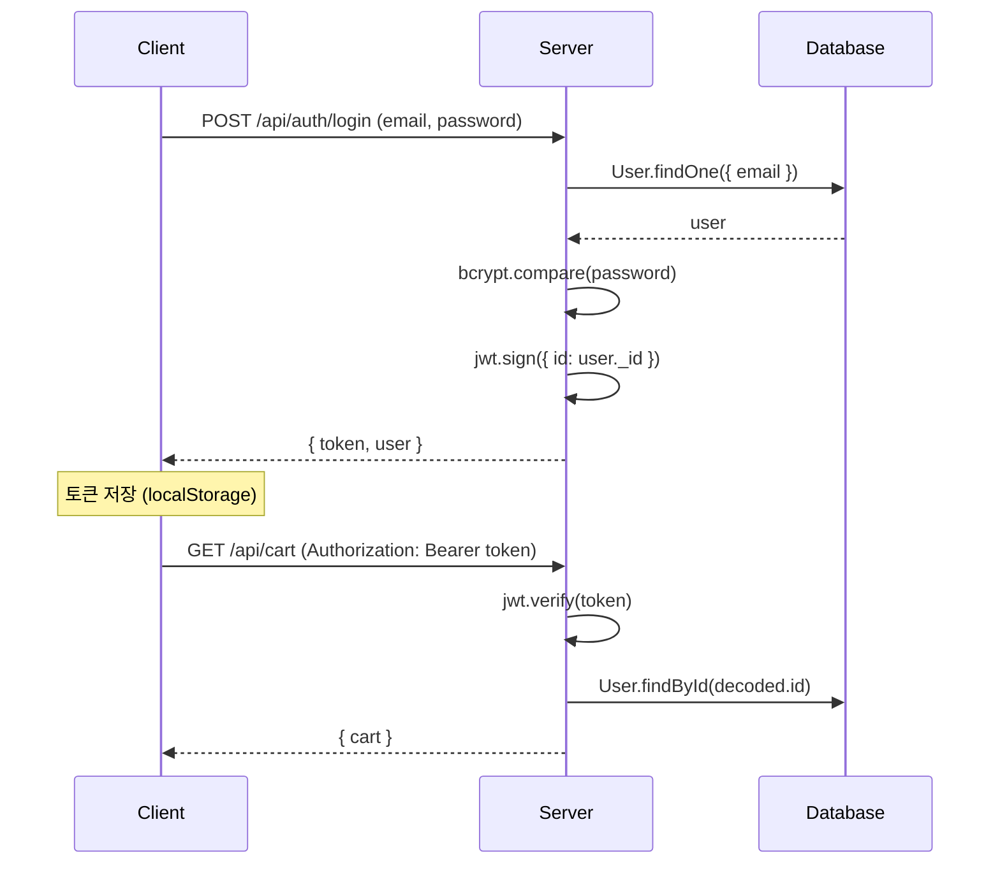
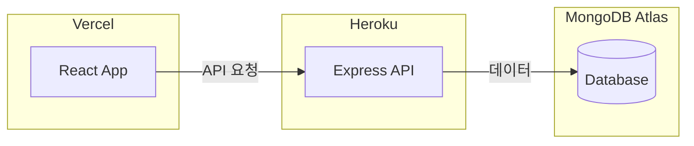

# 쇼핑몰 기술 설계서 (Technical Specification)

> **작성일**: 2025-12-22  
> **기준 문서**: [PRD.md](file:///k:/coding/vibe-coding/Shoping-mall/docs/PRD.md)

---

## 1. 시스템 아키텍처



### 1.1 기술 스택

| 구분 | 기술 | 버전/비고 |
|------|------|----------|
| **프론트엔드** | React | Vite 빌드 |
| **라우팅** | React Router DOM | SPA 라우팅 |
| **백엔드** | Node.js + Express | REST API |
| **데이터베이스** | MongoDB | Mongoose ODM |
| **인증** | JWT | Bearer Token |
| **암호화** | bcryptjs | 비밀번호 해싱 |
| **배포** | Vercel + Heroku | 클라이언트 + 서버 분리 |

---

## 2. 데이터베이스 설계

### 2.1 ERD (Entity Relationship Diagram)



### 2.2 스키마 상세

#### User
```javascript
{
  email: { type: String, unique: true, required: true },
  name: { type: String, required: true },
  password: { type: String, required: true },  // bcrypt 해싱
  user_type: { type: String, enum: ['customer', 'admin'], default: 'customer' },
  address: { type: String },
  timestamps: true
}
```

#### Product
```javascript
{
  sku: { type: String, unique: true, required: true },
  name: { type: String, required: true },
  price: { type: Number, required: true, min: 0 },
  category: { type: String, enum: ['일반', '냉장', '냉동'], required: true },
  image: { type: String, default: '' },
  description: { type: String, default: '' },
  tags: { type: [String], default: [] },
  timestamps: true
}
// 인덱스: sku (unique), tags
```

#### Cart
```javascript
{
  user: { type: ObjectId, ref: 'User', unique: true },
  items: [{
    product: { type: ObjectId, ref: 'Product' },
    quantity: { type: Number, min: 1, default: 1 }
  }],
  timestamps: true
}
// 가상 필드: totalPrice, totalItems
// 메서드: addItem(), removeItem(), updateItemQuantity(), clearCart()
```

#### Order
```javascript
{
  orderNumber: { type: String, unique: true },  // 자동생성: ORD-YYYYMMDD-0001
  user: { type: ObjectId, ref: 'User' },
  items: [{ product, name, price, quantity }],
  shippingAddress: { recipientName, phone, zipCode, address, addressDetail, memo },
  payment: { 
    method: ['card', 'bank_transfer', 'kakao_pay', 'naver_pay'],
    status: ['pending', 'completed', 'failed', 'refunded'],
    impUid, merchantUid, paidAmount, paidAt
  },
  totalItemsPrice: Number,
  shippingFee: Number,
  discountAmount: Number,
  totalAmount: Number,
  status: ['pending', 'paid', 'preparing', 'shipping', 'delivered', 'cancelled', 'refund_requested', 'refunded'],
  trackingNumber: String,
  cancelReason: String,
  timestamps: true
}
```

---

## 3. API 명세

### 3.1 인증

| 메서드 | 경로 | 설명 | 인증 |
|--------|------|------|:----:|
| POST | `/api/auth/login` | 로그인 | - |
| GET | `/api/auth/me` | 내 정보 조회 | 🔐 |

**인증 방식**: JWT Bearer Token
```
Authorization: Bearer <token>
```

### 3.2 상품 (Product)

| 메서드 | 경로 | 설명 | 인증 |
|--------|------|------|:----:|
| GET | `/api/products` | 상품 목록 (페이지네이션) | - |
| GET | `/api/products/:id` | 상품 상세 | - |
| GET | `/api/products/sku/:sku` | SKU로 조회 | - |
| GET | `/api/products/tag/:tag` | 태그로 조회 | - |
| POST | `/api/products` | 상품 등록 | 🔐👑 |
| PUT | `/api/products/:id` | 상품 수정 | 🔐👑 |
| DELETE | `/api/products/:id` | 상품 삭제 | 🔐👑 |

> 🔐 = 로그인 필요, 👑 = 관리자 권한 필요

### 3.3 장바구니 (Cart)

| 메서드 | 경로 | 설명 | 인증 |
|--------|------|------|:----:|
| GET | `/api/cart` | 장바구니 조회 | 🔐 |
| POST | `/api/cart` | 상품 추가 | 🔐 |
| PUT | `/api/cart/:productId` | 수량 변경 | 🔐 |
| DELETE | `/api/cart/:productId` | 상품 제거 | 🔐 |
| DELETE | `/api/cart` | 장바구니 비우기 | 🔐 |

### 3.4 주문 (Order)

| 메서드 | 경로 | 설명 | 인증 |
|--------|------|------|:----:|
| POST | `/api/orders` | 주문 생성 | 🔐 |
| GET | `/api/orders` | 전체 주문 (관리자) | 🔐👑 |
| GET | `/api/orders/my` | 내 주문 목록 | 🔐 |
| GET | `/api/orders/:id` | 주문 상세 | 🔐 |
| PATCH | `/api/orders/:id/status` | 상태 변경 | 🔐👑 |
| PATCH | `/api/orders/:id/tracking` | 운송장 등록 | 🔐👑 |
| PATCH | `/api/orders/:id/cancel` | 주문 취소 | 🔐 |

---

## 4. 인증/보안 설계

### 4.1 인증 흐름



### 4.2 미들웨어

| 미들웨어 | 기능 |
|----------|------|
| `protect` | JWT 토큰 검증, req.user 설정 |
| `admin` | user_type === 'admin' 확인 |

---

## 5. 프론트엔드 구조

### 5.1 라우팅

| 경로 | 페이지 | 인증 |
|------|--------|:----:|
| `/` | HomePage | - |
| `/signup` | SignupPage | - |
| `/login` | LoginPage | - |
| `/product/:id` | ProductDetailPage | - |
| `/cart` | CartPage | 🔐 |
| `/order` | OrderPage | 🔐 |
| `/order/complete` | OrderCompletePage | 🔐 |
| `/order/fail` | OrderFailPage | 🔐 |
| `/orders`, `/my-orders` | MyOrdersPage | 🔐 |
| `/admin` | AdminPage | 🔐👑 |
| `/admin/products` | AdminProductsPage | 🔐👑 |
| `/admin/products/new` | AdminProductCreatePage | 🔐👑 |
| `/admin/products/edit/:id` | AdminProductEditPage | 🔐👑 |
| `/admin/orders` | AdminOrdersPage | 🔐👑 |

### 5.2 컴포넌트 구조

```
📁 src/
├── 📁 components/
│   ├── 📁 home/          # 홈페이지 컴포넌트
│   └── 📁 layout/        # 레이아웃 컴포넌트
├── 📁 pages/
│   ├── HomePage.jsx
│   ├── LoginPage.jsx
│   ├── SignupPage.jsx
│   ├── ProductDetailPage.jsx
│   ├── CartPage.jsx
│   ├── OrderPage.jsx
│   ├── OrderCompletePage.jsx
│   ├── OrderFailPage.jsx
│   ├── MyOrdersPage.jsx
│   └── 📁 admin/
│       ├── AdminPage.jsx
│       ├── AdminProductsPage.jsx
│       ├── AdminProductCreatePage.jsx
│       ├── AdminProductEditPage.jsx
│       └── AdminOrdersPage.jsx
└── App.jsx               # 라우팅 설정
```

---

## 6. 환경 변수

### 6.1 서버 (.env)

| 변수 | 설명 |
|------|------|
| `PORT` | 서버 포트 (기본: 5000) |
| `MONGODB_ATLAS_URL` | MongoDB Atlas 연결 문자열 |
| `JWT_SECRET` | JWT 서명 비밀키 |
| `NODE_ENV` | 환경 (development/production) |

### 6.2 클라이언트 (.env)

| 변수 | 설명 |
|------|------|
| `VITE_API_URL` | API 서버 URL |

---

## 7. 배포 구성



| 구분 | 플랫폼 | 설정 파일 |
|------|--------|----------|
| 클라이언트 | Vercel | `vercel.json` (옵션) |
| 서버 | Heroku | `Procfile` |
| 데이터베이스 | MongoDB Atlas | - |

---

> 💡 이 문서는 현재 구현된 시스템을 기준으로 작성되었습니다.
